# 🏗️ **Architecture Overview**

This document provides a comprehensive overview of Ragify's architecture, including system design, component interactions, and data flow.

## 🎯 **System Overview**

Ragify is designed as a **modular, scalable, and intelligent context fusion framework** that can process data from multiple sources and provide unified, relevant context for AI applications.

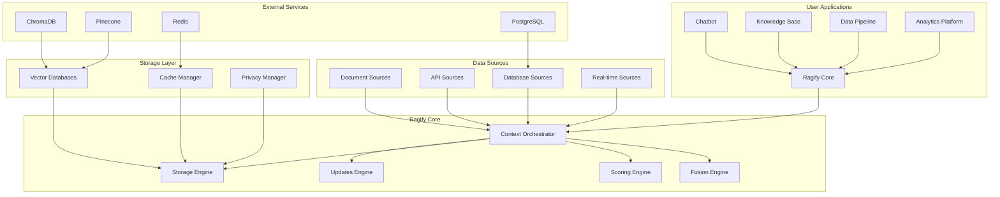

## 🧩 **Core Components**

### **1. Context Orchestrator**
The central coordinator that manages all operations and coordinates between different components.

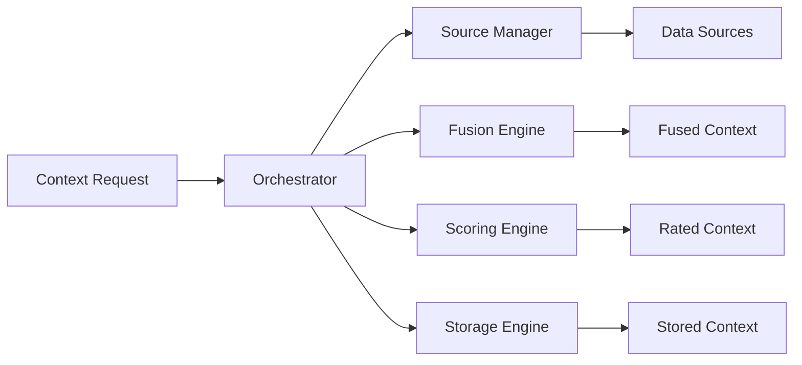

### **2. Data Sources Layer**
Handles different types of data sources with specialized processors.

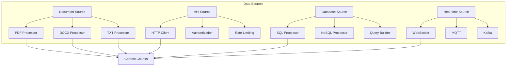

### **3. Fusion Engine**
Intelligently combines data from multiple sources with conflict resolution.

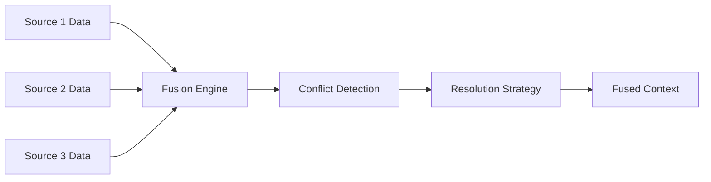

### **4. Scoring Engine**
Multi-factor scoring system for relevance assessment.

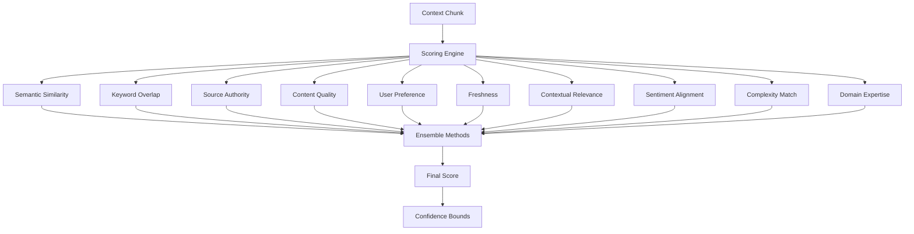

## 🔄 **Data Flow**

### **1. Context Retrieval Flow**

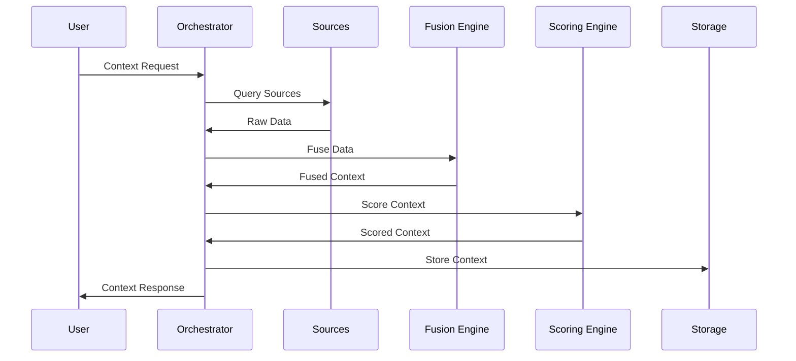

### **2. Real-time Update Flow**

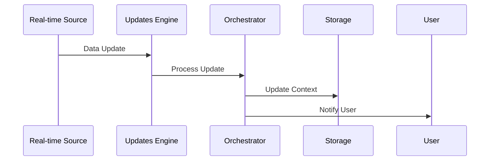

### **3. Privacy & Security Flow**

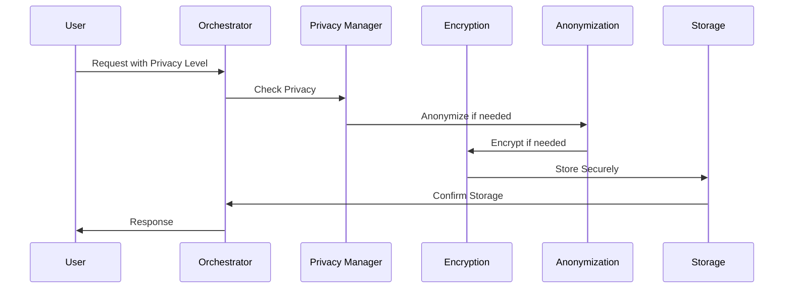

## 🏛️ **System Architecture**

### **Layered Architecture**

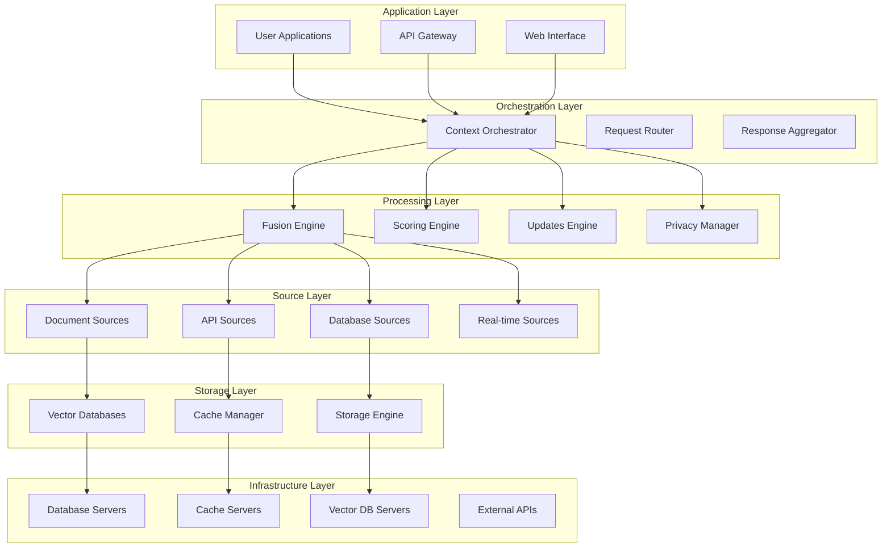

## 🔧 **Component Details**

### **1. Context Orchestrator**

**Responsibilities:**
- Coordinate all system operations
- Manage request routing
- Handle response aggregation
- Monitor system health

**Key Features:**
- Async/await support
- Request queuing
- Load balancing
- Error handling

### **2. Fusion Engine**

**Responsibilities:**
- Combine data from multiple sources
- Detect and resolve conflicts
- Apply fusion strategies
- Maintain data consistency

**Fusion Strategies:**
- **Highest Relevance**: Select most relevant data
- **Newest Data**: Prefer recent information
- **Highest Authority**: Trust authoritative sources
- **Consensus**: Use majority agreement
- **Weighted Average**: Combine with weights

### **3. Scoring Engine**

**Responsibilities:**
- Calculate relevance scores
- Apply multi-factor analysis
- Generate confidence bounds
- Optimize scoring weights

**Scoring Factors:**
- Semantic similarity (30%)
- Keyword overlap (20%)
- Source authority (15%)
- Content quality (10%)
- User preference (10%)
- Freshness (5%)
- Contextual relevance (5%)
- Sentiment alignment (2%)
- Complexity match (2%)
- Domain expertise (1%)

### **4. Storage Engine**

**Responsibilities:**
- Manage data persistence
- Handle compression/encryption
- Implement retention policies
- Optimize storage performance

**Storage Features:**
- Multi-backend support
- Automatic compression
- Encryption at rest
- Data deduplication
- Backup and recovery

## 🚀 **Scalability Features**

### **1. Horizontal Scaling**

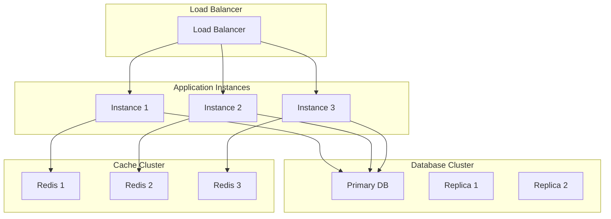

### **2. Performance Optimization**

- **Connection Pooling**: Efficient database connections
- **Caching**: Multi-level caching strategy
- **Async Processing**: Non-blocking operations
- **Batch Processing**: Bulk operations for efficiency
- **Compression**: Data compression for storage/network

### **3. Fault Tolerance**

- **Circuit Breakers**: Prevent cascade failures
- **Retry Logic**: Automatic retry with backoff
- **Fallback Mechanisms**: Graceful degradation
- **Health Checks**: Continuous monitoring
- **Data Replication**: High availability

## 🔒 **Security Architecture**

### **1. Data Protection**

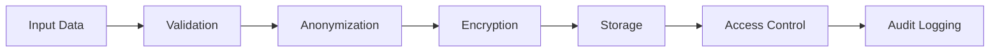

### **2. Privacy Levels**

- **PUBLIC**: No restrictions
- **PRIVATE**: Basic anonymization
- **RESTRICTED**: Encryption + anonymization
- **RESTRICTED**: Full protection + audit

### **3. Authentication & Authorization**

- **API Key Authentication**
- **OAuth2 Integration**
- **Role-based Access Control**
- **Session Management**
- **Rate Limiting**

## 📊 **Monitoring & Observability**

### **1. Metrics Collection**

- **Performance Metrics**: Response times, throughput
- **Business Metrics**: Query patterns, usage statistics
- **System Metrics**: Resource utilization, errors
- **Security Metrics**: Access patterns, violations

### **2. Logging Strategy**

- **Structured Logging**: JSON format for easy parsing
- **Log Levels**: DEBUG, INFO, WARNING, ERROR
- **Context Enrichment**: Request IDs, user context
- **Centralized Logging**: Aggregated log management

### **3. Health Monitoring**

- **Health Checks**: Endpoint availability
- **Dependency Monitoring**: Database, cache, external services
- **Alerting**: Proactive issue detection
- **Dashboard**: Real-time system status

## 🔄 **Deployment Architecture**

### **1. Development Environment**

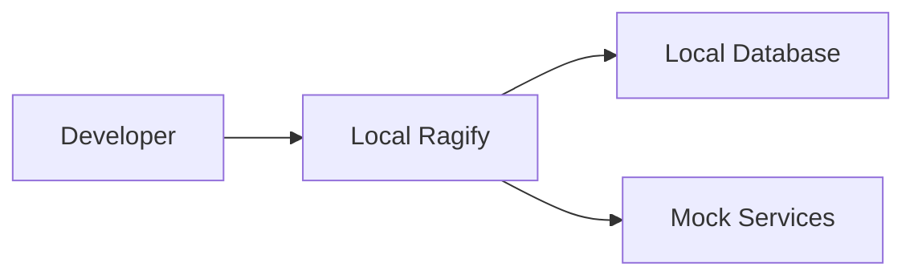

### **2. Production Environment**

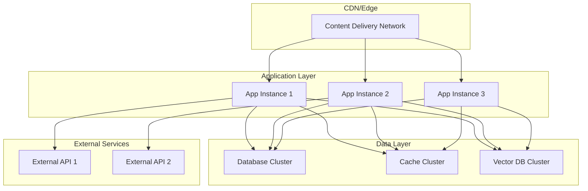

---

## 📚 **Next Steps**

- **[Data Sources](data-sources.md)** - Learn about different data source types
- **[Context Fusion](context-fusion.md)** - Understand how data fusion works
- **[Configuration](configuration.md)** - Configure Ragify for your needs
- **[API Reference](api-reference.md)** - Complete API documentation
