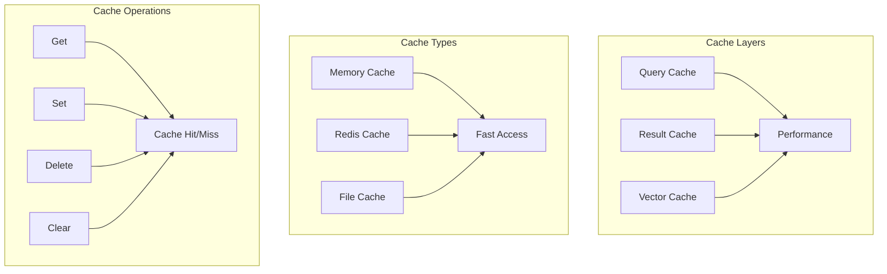

# 💾 **Cache Management**

This document explains how Ragify manages caching for improved performance and reduced latency.

## 🎯 **Overview**

Cache management in Ragify provides multiple caching strategies to optimize performance and reduce redundant computations.



## 🗄️ **Cache Types**

### **1. Memory Cache**

```python
from ragify.storage import CacheManager

# Initialize memory cache
memory_cache = CacheManager(
    cache_type="memory",
    max_size=10000,  # Maximum number of entries
    ttl=3600,  # Time to live in seconds
    eviction_policy="lru"  # Least Recently Used
)

# Basic operations
await memory_cache.set("query:ml_algorithms", {"results": [...]}, ttl=1800)
cached_results = await memory_cache.get("query:ml_algorithms")
await memory_cache.delete("query:ml_algorithms")
await memory_cache.clear()

# Get cache statistics
stats = memory_cache.get_stats()
print(f"Cache size: {stats['size']}")
print(f"Hit rate: {stats['hit_rate']:.2%}")
```

### **2. Redis Cache**

```python
# Initialize Redis cache
redis_cache = CacheManager(
    cache_type="redis",
    connection_string="redis://localhost:6379",
    ttl=7200,  # 2 hours
    max_size=100000  # Maximum entries
)

# Redis-specific features
await redis_cache.set("user:123:preferences", user_prefs, ttl=86400)
await redis_cache.set("session:456:context", session_data, ttl=1800)

# Pattern-based operations
await redis_cache.delete_pattern("user:*:preferences")
await redis_cache.delete_pattern("session:*:context")

# Redis cluster support
redis_cluster_cache = CacheManager(
    cache_type="redis",
    connection_string="redis://cluster1:6379,redis://cluster2:6379",
    cluster_mode=True
)
```

### **3. File Cache**

```python
# Initialize file cache
file_cache = CacheManager(
    cache_type="file",
    cache_dir="./cache",
    ttl=86400,  # 24 hours
    compression=True  # Enable compression
)

# File cache operations
await file_cache.set("large_dataset", large_data, ttl=604800)  # 1 week
cached_data = await file_cache.get("large_dataset")

# Cache directory structure
# ./cache/
# ├── query_cache/
# ├── result_cache/
# └── vector_cache/
```

## 🔧 **Cache Configuration**

### **1. Cache Policies**

```python
from ragify.storage import CachePolicy

# Define cache policies
cache_policies = {
    'query_cache': CachePolicy(
        ttl=1800,  # 30 minutes
        max_size=10000,
        eviction_policy="lru",
        compression=False
    ),
    'result_cache': CachePolicy(
        ttl=3600,  # 1 hour
        max_size=5000,
        eviction_policy="lfu",  # Least Frequently Used
        compression=True
    ),
    'vector_cache': CachePolicy(
        ttl=7200,  # 2 hours
        max_size=2000,
        eviction_policy="fifo",  # First In, First Out
        compression=True
    )
}

# Apply policies
for cache_name, policy in cache_policies.items():
    cache_manager = CacheManager(
        cache_type="memory",
        ttl=policy.ttl,
        max_size=policy.max_size,
        eviction_policy=policy.eviction_policy,
        compression=policy.compression
    )
```

### **2. Cache Warming**

```python
class CacheWarmer:
    def __init__(self, cache_manager):
        self.cache_manager = cache_manager
        self.popular_queries = []
    
    async def warm_cache(self, queries):
        """Warm cache with popular queries."""
        tasks = []
        for query in queries:
            task = self.warm_query(query)
            tasks.append(task)
        
        await asyncio.gather(*tasks)
    
    async def warm_query(self, query):
        """Warm cache for a specific query."""
        try:
            # Execute query and cache results
            results = await execute_query(query)
            cache_key = f"query:{hash(query)}"
            await self.cache_manager.set(cache_key, results, ttl=3600)
            print(f"Warmed cache for: {query[:50]}...")
        except Exception as e:
            print(f"Failed to warm cache for {query}: {e}")

# Usage
warmer = CacheWarmer(cache_manager)
popular_queries = [
    "machine learning algorithms",
    "python programming",
    "data science",
    "artificial intelligence"
]
await warmer.warm_cache(popular_queries)
```

### **3. Cache Invalidation**

```python
class CacheInvalidator:
    def __init__(self, cache_manager):
        self.cache_manager = cache_manager
    
    async def invalidate_by_pattern(self, pattern):
        """Invalidate cache entries matching pattern."""
        if hasattr(self.cache_manager, 'delete_pattern'):
            await self.cache_manager.delete_pattern(pattern)
        else:
            # Fallback for caches without pattern support
            await self.invalidate_all()
    
    async def invalidate_by_tags(self, tags):
        """Invalidate cache entries with specific tags."""
        for tag in tags:
            pattern = f"*:{tag}:*"
            await self.invalidate_by_pattern(pattern)
    
    async def invalidate_all(self):
        """Invalidate all cache entries."""
        await self.cache_manager.clear()
    
    async def invalidate_expired(self):
        """Remove expired cache entries."""
        # This is typically handled automatically by the cache
        # but can be called manually if needed
        pass

# Usage
invalidator = CacheInvalidator(cache_manager)

# Invalidate user-specific cache
await invalidator.invalidate_by_pattern("user:123:*")

# Invalidate by tags
await invalidator.invalidate_by_tags(["ml_algorithms", "python"])

# Invalidate all cache
await invalidator.invalidate_all()
```

## 📊 **Cache Performance**

### **1. Cache Monitoring**

```python
class CacheMonitor:
    def __init__(self, cache_manager):
        self.cache_manager = cache_manager
        self.metrics = {
            'hits': 0,
            'misses': 0,
            'sets': 0,
            'deletes': 0
        }
    
    async def get_cache_stats(self):
        """Get comprehensive cache statistics."""
        stats = await self.cache_manager.get_stats()
        
        # Calculate hit rate
        total_requests = self.metrics['hits'] + self.metrics['misses']
        hit_rate = self.metrics['hits'] / total_requests if total_requests > 0 else 0
        
        return {
            'hit_rate': hit_rate,
            'miss_rate': 1 - hit_rate,
            'total_requests': total_requests,
            'cache_size': stats.get('size', 0),
            'memory_usage': stats.get('memory_usage', 0),
            'operations': self.metrics.copy()
        }
    
    async def monitor_performance(self, duration=300):
        """Monitor cache performance over time."""
        start_time = time.time()
        initial_stats = await self.get_cache_stats()
        
        await asyncio.sleep(duration)
        
        end_time = time.time()
        final_stats = await self.get_cache_stats()
        
        # Calculate performance metrics
        duration_seconds = end_time - start_time
        requests_per_second = final_stats['total_requests'] / duration_seconds
        
        return {
            'duration': duration_seconds,
            'requests_per_second': requests_per_second,
            'hit_rate_change': final_stats['hit_rate'] - initial_stats['hit_rate'],
            'cache_growth': final_stats['cache_size'] - initial_stats['cache_size']
        }

# Usage
monitor = CacheMonitor(cache_manager)
stats = await monitor.get_cache_stats()
print(f"Hit rate: {stats['hit_rate']:.2%}")
print(f"Total requests: {stats['total_requests']}")

# Monitor performance
performance = await monitor.monitor_performance(duration=60)
print(f"Requests per second: {performance['requests_per_second']:.2f}")
```

### **2. Cache Optimization**

```python
class CacheOptimizer:
    def __init__(self, cache_manager):
        self.cache_manager = cache_manager
    
    async def optimize_cache_size(self, target_hit_rate=0.8):
        """Optimize cache size based on target hit rate."""
        current_stats = await self.cache_manager.get_stats()
        current_hit_rate = current_stats.get('hit_rate', 0)
        
        if current_hit_rate < target_hit_rate:
            # Increase cache size
            new_size = int(current_stats['size'] * 1.5)
            await self.cache_manager.resize(new_size)
            print(f"Increased cache size to {new_size}")
        elif current_hit_rate > target_hit_rate + 0.1:
            # Decrease cache size
            new_size = int(current_stats['size'] * 0.8)
            await self.cache_manager.resize(new_size)
            print(f"Decreased cache size to {new_size}")
    
    async def optimize_ttl(self, access_patterns):
        """Optimize TTL based on access patterns."""
        for pattern, access_info in access_patterns.items():
            avg_access_interval = access_info['avg_interval']
            recommended_ttl = avg_access_interval * 2  # 2x average interval
            
            # Update TTL for pattern
            await self.cache_manager.set_ttl_pattern(pattern, recommended_ttl)
    
    async def preload_frequent_items(self, access_log):
        """Preload frequently accessed items."""
        # Analyze access patterns
        item_access_count = {}
        for access in access_log:
            item_key = access['key']
            item_access_count[item_key] = item_access_count.get(item_key, 0) + 1
        
        # Preload top items
        top_items = sorted(item_access_count.items(), key=lambda x: x[1], reverse=True)[:100]
        
        for item_key, count in top_items:
            if not await self.cache_manager.exists(item_key):
                # Load item into cache
                item_data = await load_item_data(item_key)
                await self.cache_manager.set(item_key, item_data, ttl=3600)

# Usage
optimizer = CacheOptimizer(cache_manager)

# Optimize cache size
await optimizer.optimize_cache_size(target_hit_rate=0.85)

# Optimize TTL based on access patterns
access_patterns = {
    "user:*:preferences": {"avg_interval": 1800},  # 30 minutes
    "query:*:results": {"avg_interval": 3600},     # 1 hour
    "vector:*:embeddings": {"avg_interval": 7200}  # 2 hours
}
await optimizer.optimize_ttl(access_patterns)
```

## 🔄 **Cache Synchronization**

### **1. Multi-Node Cache Sync**

```python
class CacheSynchronizer:
    def __init__(self, cache_manager, sync_config):
        self.cache_manager = cache_manager
        self.sync_config = sync_config
        self.sync_queue = asyncio.Queue()
    
    async def sync_operation(self, operation, key, value=None, ttl=None):
        """Synchronize cache operation across nodes."""
        sync_message = {
            'operation': operation,
            'key': key,
            'value': value,
            'ttl': ttl,
            'timestamp': time.time(),
            'node_id': self.sync_config['node_id']
        }
        
        # Add to sync queue
        await self.sync_queue.put(sync_message)
        
        # Broadcast to other nodes
        await self.broadcast_sync_message(sync_message)
    
    async def broadcast_sync_message(self, message):
        """Broadcast sync message to other nodes."""
        for node in self.sync_config['nodes']:
            if node != self.sync_config['node_id']:
                try:
                    await self.send_to_node(node, message)
                except Exception as e:
                    print(f"Failed to sync with node {node}: {e}")
    
    async def process_sync_message(self, message):
        """Process incoming sync message."""
        operation = message['operation']
        key = message['key']
        value = message.get('value')
        ttl = message.get('ttl')
        
        if operation == 'set':
            await self.cache_manager.set(key, value, ttl=ttl)
        elif operation == 'delete':
            await self.cache_manager.delete(key)
        elif operation == 'clear':
            await self.cache_manager.clear()

# Usage
sync_config = {
    'node_id': 'node-1',
    'nodes': ['node-1', 'node-2', 'node-3']
}

synchronizer = CacheSynchronizer(cache_manager, sync_config)

# Synchronized operations
await synchronizer.sync_operation('set', 'user:123:data', user_data, ttl=3600)
await synchronizer.sync_operation('delete', 'user:123:data')
```

### **2. Cache Consistency**

```python
class CacheConsistencyManager:
    def __init__(self, cache_manager):
        self.cache_manager = cache_manager
        self.consistency_checks = []
    
    async def ensure_consistency(self, key, expected_value):
        """Ensure cache consistency for a key."""
        cached_value = await self.cache_manager.get(key)
        
        if cached_value != expected_value:
            # Inconsistency detected
            await self.handle_inconsistency(key, cached_value, expected_value)
            return False
        
        return True
    
    async def handle_inconsistency(self, key, cached_value, expected_value):
        """Handle cache inconsistency."""
        # Log inconsistency
        print(f"Cache inconsistency detected for key: {key}")
        print(f"Cached: {cached_value}")
        print(f"Expected: {expected_value}")
        
        # Update cache with correct value
        await self.cache_manager.set(key, expected_value)
        
        # Record inconsistency
        self.consistency_checks.append({
            'key': key,
            'cached_value': cached_value,
            'expected_value': expected_value,
            'timestamp': time.time()
        })
    
    async def validate_cache_integrity(self):
        """Validate overall cache integrity."""
        stats = await self.cache_manager.get_stats()
        integrity_score = 1.0
        
        # Check for common integrity issues
        if stats.get('corrupted_entries', 0) > 0:
            integrity_score -= 0.2
        
        if stats.get('memory_fragmentation', 0) > 0.3:
            integrity_score -= 0.1
        
        return integrity_score

# Usage
consistency_manager = CacheConsistencyManager(cache_manager)

# Check consistency
is_consistent = await consistency_manager.ensure_consistency('user:123:data', expected_data)

# Validate integrity
integrity_score = await consistency_manager.validate_cache_integrity()
print(f"Cache integrity score: {integrity_score:.2f}")
```

## 🎯 **Best Practices**

### **1. Cache Key Design**

```python
def design_cache_key(prefix, *args, **kwargs):
    """Design consistent cache keys."""
    # Convert args to strings
    arg_strings = [str(arg) for arg in args]
    
    # Convert kwargs to sorted key-value pairs
    kwarg_strings = [f"{k}:{v}" for k, v in sorted(kwargs.items())]
    
    # Combine all parts
    key_parts = [prefix] + arg_strings + kwarg_strings
    return ":".join(key_parts)

# Usage examples
user_cache_key = design_cache_key("user", user_id, preferences=True)
query_cache_key = design_cache_key("query", query_text, max_results=10, filters={"category": "ml"})
vector_cache_key = design_cache_key("vector", embedding_model, text_hash)

print(f"User key: {user_cache_key}")
print(f"Query key: {query_cache_key}")
print(f"Vector key: {vector_cache_key}")
```

### **2. Cache Strategy Selection**

```python
def select_cache_strategy(use_case, data_size, access_pattern):
    """Select appropriate cache strategy."""
    if use_case == "frequent_reads":
        if data_size < 1000:  # Small data
            return {
                'type': 'memory',
                'ttl': 3600,
                'max_size': 10000
            }
        else:  # Large data
            return {
                'type': 'redis',
                'ttl': 7200,
                'compression': True
            }
    
    elif use_case == "write_heavy":
        return {
            'type': 'redis',
            'ttl': 1800,
            'write_through': True
        }
    
    elif use_case == "persistent":
        return {
            'type': 'file',
            'ttl': 86400,
            'compression': True
        }
    
    else:
        return {
            'type': 'memory',
            'ttl': 1800,
            'max_size': 5000
        }

# Usage
strategy = select_cache_strategy(
    use_case="frequent_reads",
    data_size=500,
    access_pattern="read_heavy"
)
cache_manager = CacheManager(**strategy)
```

---

## 📚 **Next Steps**

- **[Storage Engine](storage-engine.md)** - Understand storage and compression
- **[Vector Databases](vector-databases.md)** - Learn about vector database integration
- **[Performance](performance.md)** - Performance optimization guide
- **[Configuration](configuration.md)** - Cache configuration options
