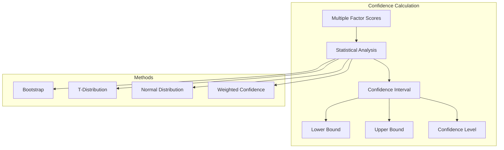

# 📊 **Statistical Confidence Bounds**

This document explains how Ragify calculates and uses statistical confidence bounds for relevance scores to provide reliability metrics.

## 🎯 **Overview**

Confidence bounds provide statistical reliability measures for relevance scores, helping users understand the uncertainty in context retrieval results.



## 📈 **Confidence Bound Methods**

### **1. Bootstrap Confidence Intervals**

```python
import numpy as np
from scipy import stats

def calculate_bootstrap_confidence(scores, confidence_level=0.95, n_bootstrap=1000):
    """
    Calculate bootstrap confidence intervals for scores.
    
    Args:
        scores: List of factor scores
        confidence_level: Confidence level (e.g., 0.95 for 95%)
        n_bootstrap: Number of bootstrap samples
    
    Returns:
        Dictionary with confidence bounds
    """
    if len(scores) < 2:
        return {
            'lower_bound': min(scores) if scores else 0.0,
            'upper_bound': max(scores) if scores else 1.0,
            'confidence_level': confidence_level,
            'method': 'bootstrap'
        }
    
    # Generate bootstrap samples
    bootstrap_means = []
    for _ in range(n_bootstrap):
        bootstrap_sample = np.random.choice(scores, size=len(scores), replace=True)
        bootstrap_means.append(np.mean(bootstrap_sample))
    
    # Calculate confidence bounds
    lower_percentile = (1 - confidence_level) / 2 * 100
    upper_percentile = (1 + confidence_level) / 2 * 100
    
    lower_bound = np.percentile(bootstrap_means, lower_percentile)
    upper_bound = np.percentile(bootstrap_means, upper_percentile)
    
    return {
        'lower_bound': lower_bound,
        'upper_bound': upper_bound,
        'confidence_level': confidence_level,
        'method': 'bootstrap',
        'bootstrap_samples': n_bootstrap
    }

# Usage
factor_scores = [0.8, 0.7, 0.9, 0.6, 0.85]
confidence_bounds = calculate_bootstrap_confidence(factor_scores, confidence_level=0.95)
print(f"95% Confidence Interval: [{confidence_bounds['lower_bound']:.3f}, {confidence_bounds['upper_bound']:.3f}]")
```

### **2. T-Distribution Confidence Intervals**

```python
def calculate_t_confidence(scores, confidence_level=0.95):
    """
    Calculate confidence intervals using t-distribution.
    
    Args:
        scores: List of factor scores
        confidence_level: Confidence level
    
    Returns:
        Dictionary with confidence bounds
    """
    if len(scores) < 2:
        return {
            'lower_bound': min(scores) if scores else 0.0,
            'upper_bound': max(scores) if scores else 1.0,
            'confidence_level': confidence_level,
            'method': 't_distribution'
        }
    
    # Calculate mean and standard error
    mean_score = np.mean(scores)
    std_error = np.std(scores) / np.sqrt(len(scores))
    
    # Calculate confidence interval
    confidence_interval = stats.t.interval(
        confidence_level, 
        len(scores) - 1, 
        loc=mean_score, 
        scale=std_error
    )
    
    return {
        'lower_bound': confidence_interval[0],
        'upper_bound': confidence_interval[1],
        'confidence_level': confidence_level,
        'method': 't_distribution',
        'degrees_of_freedom': len(scores) - 1
    }

# Usage
factor_scores = [0.8, 0.7, 0.9, 0.6, 0.85]
t_confidence = calculate_t_confidence(factor_scores, confidence_level=0.95)
print(f"T-Distribution CI: [{t_confidence['lower_bound']:.3f}, {t_confidence['upper_bound']:.3f}]")
```

### **3. Normal Distribution Confidence Intervals**

```python
def calculate_normal_confidence(scores, confidence_level=0.95):
    """
    Calculate confidence intervals using normal distribution.
    
    Args:
        scores: List of factor scores
        confidence_level: Confidence level
    
    Returns:
        Dictionary with confidence bounds
    """
    if len(scores) < 2:
        return {
            'lower_bound': min(scores) if scores else 0.0,
            'upper_bound': max(scores) if scores else 1.0,
            'confidence_level': confidence_level,
            'method': 'normal_distribution'
        }
    
    # Calculate mean and standard error
    mean_score = np.mean(scores)
    std_error = np.std(scores) / np.sqrt(len(scores))
    
    # Calculate z-score for confidence level
    alpha = 1 - confidence_level
    z_score = stats.norm.ppf(1 - alpha / 2)
    
    # Calculate confidence interval
    margin_of_error = z_score * std_error
    lower_bound = mean_score - margin_of_error
    upper_bound = mean_score + margin_of_error
    
    return {
        'lower_bound': lower_bound,
        'upper_bound': upper_bound,
        'confidence_level': confidence_level,
        'method': 'normal_distribution',
        'z_score': z_score,
        'margin_of_error': margin_of_error
    }

# Usage
factor_scores = [0.8, 0.7, 0.9, 0.6, 0.85]
normal_confidence = calculate_normal_confidence(factor_scores, confidence_level=0.95)
print(f"Normal Distribution CI: [{normal_confidence['lower_bound']:.3f}, {normal_confidence['upper_bound']:.3f}]")
```

### **4. Weighted Confidence Intervals**

```python
def calculate_weighted_confidence(scores, weights, confidence_level=0.95):
    """
    Calculate weighted confidence intervals.
    
    Args:
        scores: List of factor scores
        weights: List of weights for each score
        confidence_level: Confidence level
    
    Returns:
        Dictionary with confidence bounds
    """
    if len(scores) != len(weights):
        raise ValueError("Scores and weights must have the same length")
    
    if len(scores) < 2:
        return {
            'lower_bound': min(scores) if scores else 0.0,
            'upper_bound': max(scores) if scores else 1.0,
            'confidence_level': confidence_level,
            'method': 'weighted'
        }
    
    # Calculate weighted mean
    weighted_mean = np.average(scores, weights=weights)
    
    # Calculate weighted variance
    weighted_variance = np.average((scores - weighted_mean) ** 2, weights=weights)
    weighted_std_error = np.sqrt(weighted_variance / len(scores))
    
    # Calculate confidence interval using t-distribution
    confidence_interval = stats.t.interval(
        confidence_level, 
        len(scores) - 1, 
        loc=weighted_mean, 
        scale=weighted_std_error
    )
    
    return {
        'lower_bound': confidence_interval[0],
        'upper_bound': confidence_interval[1],
        'confidence_level': confidence_level,
        'method': 'weighted',
        'weighted_mean': weighted_mean,
        'weighted_variance': weighted_variance
    }

# Usage
factor_scores = [0.8, 0.7, 0.9, 0.6, 0.85]
factor_weights = [0.3, 0.2, 0.25, 0.15, 0.1]
weighted_confidence = calculate_weighted_confidence(factor_scores, factor_weights)
print(f"Weighted CI: [{weighted_confidence['lower_bound']:.3f}, {weighted_confidence['upper_bound']:.3f}]")
```

## 🔄 **Confidence Bound Combination**

### **1. Multiple Method Combination**

```python
def combine_confidence_intervals(intervals, method='average'):
    """
    Combine multiple confidence intervals.
    
    Args:
        intervals: List of confidence interval dictionaries
        method: Combination method ('average', 'intersection', 'union')
    
    Returns:
        Combined confidence interval
    """
    if not intervals:
        return None
    
    if method == 'average':
        # Average the bounds
        lower_bounds = [interval['lower_bound'] for interval in intervals]
        upper_bounds = [interval['upper_bound'] for interval in intervals]
        
        return {
            'lower_bound': np.mean(lower_bounds),
            'upper_bound': np.mean(upper_bounds),
            'method': 'combined_average',
            'source_intervals': intervals
        }
    
    elif method == 'intersection':
        # Take the intersection (most conservative)
        lower_bound = max(interval['lower_bound'] for interval in intervals)
        upper_bound = min(interval['upper_bound'] for interval in intervals)
        
        return {
            'lower_bound': lower_bound,
            'upper_bound': upper_bound,
            'method': 'combined_intersection',
            'source_intervals': intervals
        }
    
    elif method == 'union':
        # Take the union (least conservative)
        lower_bound = min(interval['lower_bound'] for interval in intervals)
        upper_bound = max(interval['upper_bound'] for interval in intervals)
        
        return {
            'lower_bound': lower_bound,
            'upper_bound': upper_bound,
            'method': 'combined_union',
            'source_intervals': intervals
        }
    
    else:
        raise ValueError(f"Unknown combination method: {method}")

# Usage
factor_scores = [0.8, 0.7, 0.9, 0.6, 0.85]

# Calculate different confidence intervals
bootstrap_ci = calculate_bootstrap_confidence(factor_scores)
t_ci = calculate_t_confidence(factor_scores)
normal_ci = calculate_normal_confidence(factor_scores)

# Combine them
intervals = [bootstrap_ci, t_ci, normal_ci]
combined_ci = combine_confidence_intervals(intervals, method='average')
print(f"Combined CI: [{combined_ci['lower_bound']:.3f}, {combined_ci['upper_bound']:.3f}]")
```

### **2. Confidence Calibration**

```python
def calibrate_confidence_intervals(intervals, calibration_data):
    """
    Calibrate confidence intervals using historical data.
    
    Args:
        intervals: List of confidence intervals
        calibration_data: Historical data for calibration
    
    Returns:
        Calibrated confidence intervals
    """
    calibrated_intervals = []
    
    for interval in intervals:
        # Calculate empirical coverage
        empirical_coverage = calculate_empirical_coverage(interval, calibration_data)
        
        # Adjust confidence level if needed
        target_coverage = interval['confidence_level']
        if abs(empirical_coverage - target_coverage) > 0.05:  # 5% tolerance
            # Adjust confidence level
            adjusted_confidence = target_coverage * (target_coverage / empirical_coverage)
            
            # Recalculate interval with adjusted confidence
            recalibrated_interval = recalculate_interval(interval, adjusted_confidence)
            recalibrated_interval['calibration_factor'] = adjusted_confidence / target_coverage
            calibrated_intervals.append(recalibrated_interval)
        else:
            interval['calibration_factor'] = 1.0
            calibrated_intervals.append(interval)
    
    return calibrated_intervals

def calculate_empirical_coverage(interval, calibration_data):
    """Calculate empirical coverage of confidence interval."""
    coverage_count = 0
    total_count = len(calibration_data)
    
    for data_point in calibration_data:
        if interval['lower_bound'] <= data_point <= interval['upper_bound']:
            coverage_count += 1
    
    return coverage_count / total_count

# Usage
calibration_data = [0.75, 0.82, 0.68, 0.91, 0.73, 0.79, 0.85, 0.77]
intervals = [bootstrap_ci, t_ci, normal_ci]
calibrated_intervals = calibrate_confidence_intervals(intervals, calibration_data)
```

## 📊 **Confidence Bound Validation**

### **1. Coverage Analysis**

```python
def validate_confidence_intervals(intervals, test_data, confidence_level=0.95):
    """
    Validate confidence intervals using test data.
    
    Args:
        intervals: List of confidence intervals
        test_data: Test data for validation
        confidence_level: Expected confidence level
    
    Returns:
        Validation results
    """
    validation_results = {}
    
    for i, interval in enumerate(intervals):
        # Calculate empirical coverage
        empirical_coverage = calculate_empirical_coverage(interval, test_data)
        
        # Calculate coverage error
        coverage_error = abs(empirical_coverage - confidence_level)
        
        # Determine if interval is well-calibrated
        well_calibrated = coverage_error < 0.05  # 5% tolerance
        
        validation_results[f'interval_{i}'] = {
            'method': interval['method'],
            'expected_coverage': confidence_level,
            'empirical_coverage': empirical_coverage,
            'coverage_error': coverage_error,
            'well_calibrated': well_calibrated,
            'lower_bound': interval['lower_bound'],
            'upper_bound': interval['upper_bound']
        }
    
    return validation_results

# Usage
test_data = [0.78, 0.83, 0.71, 0.89, 0.76, 0.81, 0.87, 0.74]
validation_results = validate_confidence_intervals(intervals, test_data)

for interval_name, result in validation_results.items():
    print(f"{interval_name}: Coverage = {result['empirical_coverage']:.3f}, "
          f"Error = {result['coverage_error']:.3f}, "
          f"Well-calibrated = {result['well_calibrated']}")
```

### **2. Width Analysis**

```python
def analyze_interval_widths(intervals):
    """
    Analyze the widths of confidence intervals.
    
    Args:
        intervals: List of confidence intervals
    
    Returns:
        Width analysis results
    """
    width_analysis = {}
    
    for i, interval in enumerate(intervals):
        width = interval['upper_bound'] - interval['lower_bound']
        
        width_analysis[f'interval_{i}'] = {
            'method': interval['method'],
            'width': width,
            'lower_bound': interval['lower_bound'],
            'upper_bound': interval['upper_bound'],
            'center': (interval['lower_bound'] + interval['upper_bound']) / 2
        }
    
    # Calculate statistics
    widths = [analysis['width'] for analysis in width_analysis.values()]
    width_analysis['summary'] = {
        'mean_width': np.mean(widths),
        'std_width': np.std(widths),
        'min_width': min(widths),
        'max_width': max(widths),
        'narrowest_method': min(width_analysis.items(), key=lambda x: x[1]['width'])[0],
        'widest_method': max(width_analysis.items(), key=lambda x: x[1]['width'])[0]
    }
    
    return width_analysis

# Usage
width_analysis = analyze_interval_widths(intervals)
print(f"Mean width: {width_analysis['summary']['mean_width']:.3f}")
print(f"Narrowest method: {width_analysis['summary']['narrowest_method']}")
print(f"Widest method: {width_analysis['summary']['widest_method']}")
```

## 🎯 **Practical Applications**

### **1. Confidence-Based Filtering**

```python
def filter_by_confidence(chunks, min_confidence_width=0.1):
    """
    Filter chunks based on confidence interval width.
    
    Args:
        chunks: List of context chunks
        min_confidence_width: Minimum acceptable confidence interval width
    
    Returns:
        Filtered chunks
    """
    filtered_chunks = []
    
    for chunk in chunks:
        if hasattr(chunk.relevance_score, 'confidence_lower') and \
           hasattr(chunk.relevance_score, 'confidence_upper'):
            
            confidence_width = chunk.relevance_score.confidence_upper - chunk.relevance_score.confidence_lower
            
            if confidence_width <= min_confidence_width:
                filtered_chunks.append(chunk)
    
    return filtered_chunks

# Usage
filtered_chunks = filter_by_confidence(chunks, min_confidence_width=0.15)
print(f"Filtered {len(filtered_chunks)} chunks with narrow confidence intervals")
```

### **2. Confidence-Aware Ranking**

```python
def rank_by_confidence(chunks):
    """
    Rank chunks by confidence-adjusted score.
    
    Args:
        chunks: List of context chunks
    
    Returns:
        Ranked chunks
    """
    def confidence_adjusted_score(chunk):
        base_score = chunk.relevance_score.score
        
        if hasattr(chunk.relevance_score, 'confidence_lower') and \
           hasattr(chunk.relevance_score, 'confidence_upper'):
            
            confidence_width = chunk.relevance_score.confidence_upper - chunk.relevance_score.confidence_lower
            confidence_penalty = confidence_width * 0.5  # Penalty for uncertainty
            
            return base_score - confidence_penalty
        
        return base_score
    
    return sorted(chunks, key=confidence_adjusted_score, reverse=True)

# Usage
ranked_chunks = rank_by_confidence(chunks)
for i, chunk in enumerate(ranked_chunks[:5]):
    print(f"{i+1}. Score: {chunk.relevance_score.score:.3f}, "
          f"Confidence: [{chunk.relevance_score.confidence_lower:.3f}, {chunk.relevance_score.confidence_upper:.3f}]")
```

### **3. Confidence Reporting**

```python
def generate_confidence_report(chunks):
    """
    Generate a confidence analysis report.
    
    Args:
        chunks: List of context chunks
    
    Returns:
        Confidence report
    """
    report = {
        'total_chunks': len(chunks),
        'chunks_with_confidence': 0,
        'average_confidence_width': 0.0,
        'confidence_distribution': {},
        'recommendations': []
    }
    
    confidence_widths = []
    
    for chunk in chunks:
        if hasattr(chunk.relevance_score, 'confidence_lower') and \
           hasattr(chunk.relevance_score, 'confidence_upper'):
            
            report['chunks_with_confidence'] += 1
            width = chunk.relevance_score.confidence_upper - chunk.relevance_score.confidence_lower
            confidence_widths.append(width)
            
            # Categorize confidence width
            if width < 0.1:
                category = 'high_confidence'
            elif width < 0.2:
                category = 'medium_confidence'
            else:
                category = 'low_confidence'
            
            report['confidence_distribution'][category] = report['confidence_distribution'].get(category, 0) + 1
    
    if confidence_widths:
        report['average_confidence_width'] = np.mean(confidence_widths)
    
    # Generate recommendations
    if report['chunks_with_confidence'] < len(chunks) * 0.5:
        report['recommendations'].append("Enable confidence calculation for more chunks")
    
    if report['average_confidence_width'] > 0.2:
        report['recommendations'].append("Consider using more data sources to reduce uncertainty")
    
    return report

# Usage
confidence_report = generate_confidence_report(chunks)
print(f"Total chunks: {confidence_report['total_chunks']}")
print(f"Chunks with confidence: {confidence_report['chunks_with_confidence']}")
print(f"Average confidence width: {confidence_report['average_confidence_width']:.3f}")
print("Recommendations:")
for rec in confidence_report['recommendations']:
    print(f"  - {rec}")
```

---

## 📚 **Next Steps**

- **[Scoring System](scoring.md)** - Multi-factor scoring with ensemble methods
- **[Ensemble Methods](ensemble-methods.md)** - Advanced ensemble techniques
- **[API Reference](api-reference.md)** - Complete API documentation
- **[Configuration](configuration.md)** - Confidence bounds configuration
