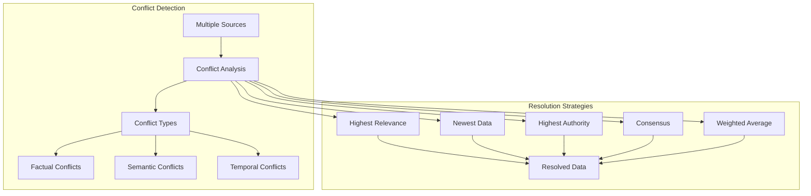

# ⚖️ **Conflict Resolution**

This document explains the conflict resolution strategies used in Ragify for handling data conflicts during context fusion.

## 🎯 **Overview**

Conflict resolution strategies determine how Ragify handles conflicting information from different data sources during the fusion process.



## 🔍 **Conflict Types**

### **1. Factual Conflicts**

```python
def detect_factual_conflicts(chunk1, chunk2):
    """
    Detect factual conflicts between two chunks.
    
    Args:
        chunk1: First context chunk
        chunk2: Second context chunk
    
    Returns:
        Conflict information if detected
    """
    # Extract factual statements
    facts1 = extract_facts(chunk1.content)
    facts2 = extract_facts(chunk2.content)
    
    conflicts = []
    
    for fact1 in facts1:
        for fact2 in facts2:
            if are_contradictory(fact1, fact2):
                conflicts.append({
                    'type': 'factual',
                    'fact1': fact1,
                    'fact2': fact2,
                    'confidence': calculate_conflict_confidence(fact1, fact2)
                })
    
    return conflicts

def extract_facts(text):
    """Extract factual statements from text."""
    # Simple fact extraction (use NLP in production)
    sentences = text.split('.')
    facts = []
    
    for sentence in sentences:
        sentence = sentence.strip()
        if len(sentence) > 10 and any(keyword in sentence.lower() for keyword in ['is', 'are', 'was', 'were', 'has', 'have']):
            facts.append(sentence)
    
    return facts

def are_contradictory(fact1, fact2):
    """Check if two facts are contradictory."""
    # Simple contradiction detection
    fact1_lower = fact1.lower()
    fact2_lower = fact2.lower()
    
    # Check for negation patterns
    negations = ['not', 'no', 'never', 'none', 'neither', 'nor']
    
    for negation in negations:
        if negation in fact1_lower and negation not in fact2_lower:
            # Check if facts are about the same subject
            if has_same_subject(fact1, fact2):
                return True
    
    return False

# Usage
conflicts = detect_factual_conflicts(chunk1, chunk2)
for conflict in conflicts:
    print(f"Factual conflict: {conflict['fact1']} vs {conflict['fact2']}")
```

### **2. Semantic Conflicts**

```python
def detect_semantic_conflicts(chunk1, chunk2, similarity_threshold=0.8):
    """
    Detect semantic conflicts between chunks.
    
    Args:
        chunk1: First context chunk
        chunk2: Second context chunk
        similarity_threshold: Threshold for similarity detection
    
    Returns:
        Semantic conflict information
    """
    # Calculate semantic similarity
    similarity = calculate_semantic_similarity(chunk1.content, chunk2.content)
    
    if similarity > similarity_threshold:
        # Check for semantic conflicts
        semantic_conflicts = analyze_semantic_conflicts(chunk1, chunk2)
        return semantic_conflicts
    
    return []

def analyze_semantic_conflicts(chunk1, chunk2):
    """Analyze semantic conflicts between similar chunks."""
    conflicts = []
    
    # Extract key concepts
    concepts1 = extract_concepts(chunk1.content)
    concepts2 = extract_concepts(chunk2.content)
    
    # Compare concepts
    for concept1 in concepts1:
        for concept2 in concepts2:
            if concept1['term'] == concept2['term'] and concept1['interpretation'] != concept2['interpretation']:
                conflicts.append({
                    'type': 'semantic',
                    'concept': concept1['term'],
                    'interpretation1': concept1['interpretation'],
                    'interpretation2': concept2['interpretation'],
                    'confidence': calculate_semantic_conflict_confidence(concept1, concept2)
                })
    
    return conflicts

def extract_concepts(text):
    """Extract key concepts from text."""
    # Simple concept extraction (use NLP in production)
    words = text.lower().split()
    concepts = []
    
    # Define concept patterns
    concept_patterns = {
        'algorithm': ['algorithm', 'method', 'technique', 'approach'],
        'performance': ['performance', 'efficiency', 'speed', 'accuracy'],
        'implementation': ['implementation', 'code', 'program', 'system']
    }
    
    for pattern_name, keywords in concept_patterns.items():
        for keyword in keywords:
            if keyword in words:
                concepts.append({
                    'term': keyword,
                    'pattern': pattern_name,
                    'interpretation': extract_interpretation(text, keyword)
                })
    
    return concepts

# Usage
semantic_conflicts = detect_semantic_conflicts(chunk1, chunk2)
for conflict in semantic_conflicts:
    print(f"Semantic conflict: {conflict['concept']} - {conflict['interpretation1']} vs {conflict['interpretation2']}")
```

### **3. Temporal Conflicts**

```python
from datetime import datetime, timedelta

def detect_temporal_conflicts(chunk1, chunk2, time_threshold_days=30):
    """
    Detect temporal conflicts between chunks.
    
    Args:
        chunk1: First context chunk
        chunk2: Second context chunk
        time_threshold_days: Threshold for temporal conflicts
    
    Returns:
        Temporal conflict information
    """
    # Extract temporal information
    time1 = extract_temporal_info(chunk1)
    time2 = extract_temporal_info(chunk2)
    
    if time1 and time2:
        time_diff = abs(time1['value'] - time2['value'])
        
        if time_diff > timedelta(days=time_threshold_days):
            return {
                'type': 'temporal',
                'time1': time1,
                'time2': time2,
                'difference_days': time_diff.days,
                'confidence': calculate_temporal_conflict_confidence(time1, time2)
            }
    
    return None

def extract_temporal_info(chunk):
    """Extract temporal information from chunk."""
    # Check metadata first
    if 'timestamp' in chunk.metadata:
        timestamp = chunk.metadata['timestamp']
        if isinstance(timestamp, str):
            timestamp = datetime.fromisoformat(timestamp.replace('Z', '+00:00'))
        return {
            'type': 'absolute',
            'value': timestamp,
            'source': 'metadata'
        }
    
    # Extract from content
    temporal_patterns = [
        r'(\d{4}-\d{2}-\d{2})',  # YYYY-MM-DD
        r'(\d{1,2}/\d{1,2}/\d{4})',  # MM/DD/YYYY
        r'(yesterday|today|tomorrow)',
        r'(\d+ days? ago)',
        r'(\d+ years? ago)'
    ]
    
    for pattern in temporal_patterns:
        match = re.search(pattern, chunk.content, re.IGNORECASE)
        if match:
            return {
                'type': 'relative',
                'value': parse_temporal_expression(match.group(1)),
                'source': 'content',
                'expression': match.group(1)
            }
    
    return None

def parse_temporal_expression(expression):
    """Parse temporal expression to datetime."""
    now = datetime.now()
    
    if expression.lower() == 'today':
        return now
    elif expression.lower() == 'yesterday':
        return now - timedelta(days=1)
    elif expression.lower() == 'tomorrow':
        return now + timedelta(days=1)
    elif 'days ago' in expression.lower():
        days = int(re.search(r'(\d+)', expression).group(1))
        return now - timedelta(days=days)
    elif 'years ago' in expression.lower():
        years = int(re.search(r'(\d+)', expression).group(1))
        return now - timedelta(days=years * 365)
    else:
        # Try to parse as date
        try:
            return datetime.strptime(expression, '%Y-%m-%d')
        except ValueError:
            try:
                return datetime.strptime(expression, '%m/%d/%Y')
            except ValueError:
                return now

# Usage
temporal_conflict = detect_temporal_conflicts(chunk1, chunk2)
if temporal_conflict:
    print(f"Temporal conflict: {temporal_conflict['time1']['value']} vs {temporal_conflict['time2']['value']}")
    print(f"Difference: {temporal_conflict['difference_days']} days")
```

## ⚖️ **Resolution Strategies**

### **1. Highest Relevance Strategy**

```python
def resolve_highest_relevance(chunks, conflicts):
    """
    Resolve conflicts by selecting chunks with highest relevance.
    
    Args:
        chunks: List of context chunks
        conflicts: List of detected conflicts
    
    Returns:
        Resolved chunks
    """
    resolved_chunks = []
    
    for conflict in conflicts:
        chunk1 = conflict['chunk1']
        chunk2 = conflict['chunk2']
        
        # Select chunk with higher relevance score
        if chunk1.relevance_score.score > chunk2.relevance_score.score:
            resolved_chunks.append(chunk1)
        else:
            resolved_chunks.append(chunk2)
    
    return resolved_chunks

# Usage
resolved_chunks = resolve_highest_relevance(chunks, conflicts)
print(f"Resolved {len(resolved_chunks)} conflicts using highest relevance strategy")
```

### **2. Newest Data Strategy**

```python
def resolve_newest_data(chunks, conflicts):
    """
    Resolve conflicts by preferring newest data.
    
    Args:
        chunks: List of context chunks
        conflicts: List of detected conflicts
    
    Returns:
        Resolved chunks
    """
    resolved_chunks = []
    
    for conflict in conflicts:
        chunk1 = conflict['chunk1']
        chunk2 = conflict['chunk2']
        
        # Extract timestamps
        time1 = extract_timestamp(chunk1)
        time2 = extract_timestamp(chunk2)
        
        # Select newer chunk
        if time1 > time2:
            resolved_chunks.append(chunk1)
        else:
            resolved_chunks.append(chunk2)
    
    return resolved_chunks

def extract_timestamp(chunk):
    """Extract timestamp from chunk."""
    # Check metadata
    if 'timestamp' in chunk.metadata:
        timestamp = chunk.metadata['timestamp']
        if isinstance(timestamp, str):
            return datetime.fromisoformat(timestamp.replace('Z', '+00:00'))
        return timestamp
    
    # Check creation time
    if hasattr(chunk, 'created_at'):
        return chunk.created_at
    
    # Default to current time
    return datetime.now()

# Usage
resolved_chunks = resolve_newest_data(chunks, conflicts)
print(f"Resolved {len(resolved_chunks)} conflicts using newest data strategy")
```

### **3. Highest Authority Strategy**

```python
def resolve_highest_authority(chunks, conflicts):
    """
    Resolve conflicts by preferring authoritative sources.
    
    Args:
        chunks: List of context chunks
        conflicts: List of detected conflicts
    
    Returns:
        Resolved chunks
    """
    # Define authority levels
    authority_levels = {
        'peer_reviewed': 10,
        'official_documentation': 9,
        'expert_opinion': 8,
        'news_article': 6,
        'user_generated': 3,
        'social_media': 1
    }
    
    resolved_chunks = []
    
    for conflict in conflicts:
        chunk1 = conflict['chunk1']
        chunk2 = conflict['chunk2']
        
        # Calculate authority scores
        auth1 = calculate_authority_score(chunk1, authority_levels)
        auth2 = calculate_authority_score(chunk2, authority_levels)
        
        # Select higher authority chunk
        if auth1 > auth2:
            resolved_chunks.append(chunk1)
        else:
            resolved_chunks.append(chunk2)
    
    return resolved_chunks

def calculate_authority_score(chunk, authority_levels):
    """Calculate authority score for a chunk."""
    # Base score from source type
    source_type = chunk.source.source_type
    base_score = authority_levels.get(source_type, 5)
    
    # Enhancements
    enhancements = 0
    
    # Domain authority
    if has_domain_authority(chunk.source):
        enhancements += 2
    
    # User ratings
    user_rating = get_user_rating(chunk.source)
    enhancements += user_rating * 0.1
    
    # Verification status
    if chunk.metadata.get('verified', False):
        enhancements += 1
    
    # Recent updates
    if has_recent_updates(chunk.source):
        enhancements += 0.5
    
    return min(10, base_score + enhancements)

def has_domain_authority(source):
    """Check if source has domain authority."""
    authoritative_domains = [
        'official', 'gov', 'edu', 'research', 'expert', 'authority'
    ]
    
    return any(domain in source.name.lower() for domain in authoritative_domains)

# Usage
resolved_chunks = resolve_highest_authority(chunks, conflicts)
print(f"Resolved {len(resolved_chunks)} conflicts using highest authority strategy")
```

### **4. Consensus Strategy**

```python
def resolve_consensus(chunks, conflicts):
    """
    Resolve conflicts by finding consensus among sources.
    
    Args:
        chunks: List of context chunks
        conflicts: List of detected conflicts
    
    Returns:
        Resolved chunks
    """
    resolved_chunks = []
    
    for conflict in conflicts:
        # Find similar chunks
        similar_chunks = find_similar_chunks(conflict['chunk1'], chunks)
        
        # Find consensus
        consensus = find_consensus(similar_chunks)
        
        if consensus:
            resolved_chunks.append(consensus)
        else:
            # Fallback to highest relevance
            resolved_chunks.append(conflict['chunk1'] if conflict['chunk1'].relevance_score.score > conflict['chunk2'].relevance_score.score else conflict['chunk2'])
    
    return resolved_chunks

def find_similar_chunks(target_chunk, all_chunks, similarity_threshold=0.7):
    """Find chunks similar to target chunk."""
    similar_chunks = []
    
    for chunk in all_chunks:
        if chunk.id != target_chunk.id:
            similarity = calculate_semantic_similarity(target_chunk.content, chunk.content)
            if similarity > similarity_threshold:
                similar_chunks.append(chunk)
    
    return similar_chunks

def find_consensus(chunks):
    """Find consensus among similar chunks."""
    if len(chunks) < 2:
        return chunks[0] if chunks else None
    
    # Extract key statements
    statements = []
    for chunk in chunks:
        statements.extend(extract_statements(chunk.content))
    
    # Group similar statements
    statement_groups = group_similar_statements(statements)
    
    # Find majority consensus
    for group in statement_groups:
        if len(group) > len(chunks) / 2:  # Majority
            return create_consensus_chunk(group, chunks)
    
    return None

def extract_statements(text):
    """Extract statements from text."""
    sentences = text.split('.')
    return [s.strip() for s in sentences if len(s.strip()) > 10]

def group_similar_statements(statements, similarity_threshold=0.8):
    """Group similar statements together."""
    groups = []
    used = set()
    
    for i, statement1 in enumerate(statements):
        if i in used:
            continue
        
        group = [statement1]
        used.add(i)
        
        for j, statement2 in enumerate(statements[i+1:], i+1):
            if j not in used:
                similarity = calculate_semantic_similarity(statement1, statement2)
                if similarity > similarity_threshold:
                    group.append(statement2)
                    used.add(j)
        
        groups.append(group)
    
    return groups

def create_consensus_chunk(statement_group, original_chunks):
    """Create a consensus chunk from statement group."""
    # Combine statements
    combined_content = ' '.join(statement_group)
    
    # Use metadata from highest relevance chunk
    best_chunk = max(original_chunks, key=lambda c: c.relevance_score.score)
    
    return ContextChunk(
        id=uuid4(),
        content=combined_content,
        source=best_chunk.source,
        relevance_score=best_chunk.relevance_score,
        metadata={
            **best_chunk.metadata,
            'consensus': True,
            'statement_count': len(statement_group)
        }
    )

# Usage
resolved_chunks = resolve_consensus(chunks, conflicts)
print(f"Resolved {len(resolved_chunks)} conflicts using consensus strategy")
```

### **5. Weighted Average Strategy**

```python
def resolve_weighted_average(chunks, conflicts):
    """
    Resolve conflicts using weighted averaging.
    
    Args:
        chunks: List of context chunks
        conflicts: List of detected conflicts
    
    Returns:
        Resolved chunks
    """
    resolved_chunks = []
    
    for conflict in conflicts:
        chunk1 = conflict['chunk1']
        chunk2 = conflict['chunk2']
        
        # Calculate weights based on multiple factors
        weight1 = calculate_chunk_weight(chunk1)
        weight2 = calculate_chunk_weight(chunk2)
        
        # Create weighted combination
        combined_chunk = combine_chunks_weighted(chunk1, chunk2, weight1, weight2)
        resolved_chunks.append(combined_chunk)
    
    return resolved_chunks

def calculate_chunk_weight(chunk):
    """Calculate weight for a chunk based on multiple factors."""
    weight = 0.0
    
    # Relevance weight (30%)
    weight += chunk.relevance_score.score * 0.3
    
    # Authority weight (25%)
    authority_score = calculate_authority_score(chunk, authority_levels)
    weight += authority_score / 10 * 0.25
    
    # Freshness weight (20%)
    freshness_score = calculate_freshness_score(chunk)
    weight += freshness_score * 0.2
    
    # Quality weight (15%)
    quality_score = calculate_quality_score(chunk)
    weight += quality_score * 0.15
    
    # Source reliability weight (10%)
    reliability_score = get_source_reliability(chunk.source)
    weight += reliability_score * 0.1
    
    return weight

def combine_chunks_weighted(chunk1, chunk2, weight1, weight2):
    """Combine chunks using weighted averaging."""
    total_weight = weight1 + weight2
    
    # Normalize weights
    norm_weight1 = weight1 / total_weight
    norm_weight2 = weight2 / total_weight
    
    # Combine content
    combined_content = combine_content_weighted(
        chunk1.content, chunk2.content, norm_weight1, norm_weight2
    )
    
    # Combine metadata
    combined_metadata = combine_metadata_weighted(
        chunk1.metadata, chunk2.metadata, norm_weight1, norm_weight2
    )
    
    # Create combined chunk
    return ContextChunk(
        id=uuid4(),
        content=combined_content,
        source=chunk1.source,  # Use primary source
        relevance_score=combine_relevance_scores(
            chunk1.relevance_score, chunk2.relevance_score, norm_weight1, norm_weight2
        ),
        metadata=combined_metadata
    )

def combine_content_weighted(content1, content2, weight1, weight2):
    """Combine content using weighted approach."""
    # Simple weighted combination (use NLP for better results)
    sentences1 = content1.split('.')
    sentences2 = content2.split('.')
    
    # Select sentences based on weights
    combined_sentences = []
    
    # Add sentences from first content
    for sentence in sentences1:
        if random.random() < weight1:
            combined_sentences.append(sentence)
    
    # Add sentences from second content
    for sentence in sentences2:
        if random.random() < weight2:
            combined_sentences.append(sentence)
    
    return '. '.join(combined_sentences)

# Usage
resolved_chunks = resolve_weighted_average(chunks, conflicts)
print(f"Resolved {len(resolved_chunks)} conflicts using weighted average strategy")
```

## 🔧 **Conflict Resolution Engine**

```python
class ConflictResolutionEngine:
    def __init__(self, strategy='highest_relevance'):
        self.strategy = strategy
        self.resolution_methods = {
            'highest_relevance': resolve_highest_relevance,
            'newest_data': resolve_newest_data,
            'highest_authority': resolve_highest_authority,
            'consensus': resolve_consensus,
            'weighted_average': resolve_weighted_average
        }
    
    def resolve_conflicts(self, chunks, conflicts):
        """
        Resolve conflicts using the specified strategy.
        
        Args:
            chunks: List of context chunks
            conflicts: List of detected conflicts
        
        Returns:
            Resolved chunks
        """
        if not conflicts:
            return chunks
        
        resolution_method = self.resolution_methods.get(self.strategy)
        if not resolution_method:
            raise ValueError(f"Unknown resolution strategy: {self.strategy}")
        
        return resolution_method(chunks, conflicts)
    
    def set_strategy(self, strategy):
        """Set the conflict resolution strategy."""
        if strategy not in self.resolution_methods:
            raise ValueError(f"Unknown strategy: {strategy}")
        self.strategy = strategy
    
    def get_available_strategies(self):
        """Get list of available resolution strategies."""
        return list(self.resolution_methods.keys())

# Usage
resolution_engine = ConflictResolutionEngine(strategy='consensus')
resolved_chunks = resolution_engine.resolve_conflicts(chunks, conflicts)
print(f"Available strategies: {resolution_engine.get_available_strategies()}")
```

## 📊 **Conflict Analysis**

### **1. Conflict Statistics**

```python
def analyze_conflicts(conflicts):
    """
    Analyze conflict patterns and statistics.
    
    Args:
        conflicts: List of detected conflicts
    
    Returns:
        Conflict analysis results
    """
    analysis = {
        'total_conflicts': len(conflicts),
        'conflict_types': {},
        'source_pairs': {},
        'confidence_distribution': [],
        'recommendations': []
    }
    
    for conflict in conflicts:
        # Count conflict types
        conflict_type = conflict['type']
        analysis['conflict_types'][conflict_type] = analysis['conflict_types'].get(conflict_type, 0) + 1
        
        # Count source pairs
        source_pair = (conflict['chunk1'].source.name, conflict['chunk2'].source.name)
        analysis['source_pairs'][source_pair] = analysis['source_pairs'].get(source_pair, 0) + 1
        
        # Collect confidence scores
        if 'confidence' in conflict:
            analysis['confidence_distribution'].append(conflict['confidence'])
    
    # Generate recommendations
    if analysis['total_conflicts'] > 10:
        analysis['recommendations'].append("High conflict rate detected. Consider using consensus strategy.")
    
    if 'factual' in analysis['conflict_types'] and analysis['conflict_types']['factual'] > 5:
        analysis['recommendations'].append("Many factual conflicts. Consider using highest authority strategy.")
    
    return analysis

# Usage
conflict_analysis = analyze_conflicts(conflicts)
print(f"Total conflicts: {conflict_analysis['total_conflicts']}")
print(f"Conflict types: {conflict_analysis['conflict_types']}")
print(f"Recommendations: {conflict_analysis['recommendations']}")
```

### **2. Resolution Quality Assessment**

```python
def assess_resolution_quality(original_chunks, resolved_chunks, conflicts):
    """
    Assess the quality of conflict resolution.
    
    Args:
        original_chunks: Original chunks before resolution
        resolved_chunks: Chunks after resolution
        conflicts: List of conflicts that were resolved
    
    Returns:
        Quality assessment results
    """
    assessment = {
        'resolution_rate': len(resolved_chunks) / len(original_chunks),
        'conflict_resolution_rate': len(resolved_chunks) / len(conflicts),
        'average_confidence': 0.0,
        'source_diversity': 0.0,
        'quality_score': 0.0
    }
    
    # Calculate average confidence
    confidences = [chunk.relevance_score.score for chunk in resolved_chunks]
    assessment['average_confidence'] = np.mean(confidences) if confidences else 0.0
    
    # Calculate source diversity
    sources = set(chunk.source.name for chunk in resolved_chunks)
    assessment['source_diversity'] = len(sources) / len(resolved_chunks) if resolved_chunks else 0.0
    
    # Calculate overall quality score
    assessment['quality_score'] = (
        assessment['resolution_rate'] * 0.3 +
        assessment['conflict_resolution_rate'] * 0.3 +
        assessment['average_confidence'] * 0.2 +
        assessment['source_diversity'] * 0.2
    )
    
    return assessment

# Usage
quality_assessment = assess_resolution_quality(original_chunks, resolved_chunks, conflicts)
print(f"Resolution quality score: {quality_assessment['quality_score']:.3f}")
print(f"Conflict resolution rate: {quality_assessment['conflict_resolution_rate']:.2%}")
```

---

## 📚 **Next Steps**

- **[Context Fusion](context-fusion.md)** - Intelligent data fusion techniques
- **[Scoring System](scoring.md)** - Multi-factor scoring with ensemble methods
- **[API Reference](api-reference.md)** - Complete API documentation
- **[Configuration](configuration.md)** - Conflict resolution configuration
