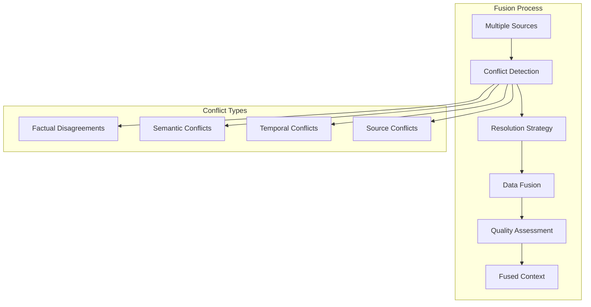

# 🔄 **Context Fusion**

This document explains how Ragify's intelligent context fusion engine works, including conflict detection, resolution strategies, and advanced fusion techniques.

## 🎯 **Overview**

Context fusion is the process of intelligently combining data from multiple sources while handling conflicts, inconsistencies, and redundancies.



## 🧠 **Intelligent Fusion Engine**

### **1. Core Components**

```python
from ragify.engines import IntelligentContextFusionEngine
from ragify.models import ConflictResolutionStrategy

# Initialize fusion engine
fusion_engine = IntelligentContextFusionEngine(
    conflict_resolution_strategy=ConflictResolutionStrategy.HIGHEST_RELEVANCE,
    enable_semantic_analysis=True,
    enable_factual_verification=True,
    similarity_threshold=0.8
)
```

### **2. Fusion Strategies**

| Strategy | Description | Use Case |
|----------|-------------|----------|
| **HIGHEST_RELEVANCE** | Select most relevant data | General purpose |
| **NEWEST_DATA** | Prefer recent information | Time-sensitive data |
| **HIGHEST_AUTHORITY** | Trust authoritative sources | Factual information |
| **CONSENSUS** | Use majority agreement | Multiple sources |
| **WEIGHTED_AVERAGE** | Combine with weights | Numerical data |

## 🔍 **Conflict Detection**

### **1. Factual Disagreements**

```python
async def detect_factual_conflicts(chunks):
    """Detect factual disagreements between chunks."""
    conflicts = []
    
    for i, chunk1 in enumerate(chunks):
        for j, chunk2 in enumerate(chunks[i+1:], i+1):
            # Check for factual disagreements
            if has_factual_disagreement(chunk1, chunk2):
                conflicts.append({
                    'type': 'factual',
                    'chunk1': chunk1,
                    'chunk2': chunk2,
                    'confidence': calculate_disagreement_confidence(chunk1, chunk2)
                })
    
    return conflicts

def has_factual_disagreement(chunk1, chunk2):
    """Check if two chunks have factual disagreements."""
    # Extract factual statements
    facts1 = extract_facts(chunk1.content)
    facts2 = extract_facts(chunk2.content)
    
    # Compare facts
    for fact1 in facts1:
        for fact2 in facts2:
            if are_contradictory(fact1, fact2):
                return True
    
    return False
```

### **2. Semantic Conflicts**

```python
async def detect_semantic_conflicts(chunks):
    """Detect semantic conflicts between chunks."""
    conflicts = []
    
    for i, chunk1 in enumerate(chunks):
        for j, chunk2 in enumerate(chunks[i+1:], i+1):
            # Calculate semantic similarity
            similarity = calculate_semantic_similarity(chunk1, chunk2)
            
            # Check for semantic conflicts
            if similarity > 0.8 and has_semantic_conflict(chunk1, chunk2):
                conflicts.append({
                    'type': 'semantic',
                    'chunk1': chunk1,
                    'chunk2': chunk2,
                    'similarity': similarity,
                    'conflict_type': identify_semantic_conflict_type(chunk1, chunk2)
                })
    
    return conflicts

def has_semantic_conflict(chunk1, chunk2):
    """Check for semantic conflicts between chunks."""
    # Extract key concepts
    concepts1 = extract_concepts(chunk1.content)
    concepts2 = extract_concepts(chunk2.content)
    
    # Check for conflicting interpretations
    for concept1 in concepts1:
        for concept2 in concepts2:
            if concept1['term'] == concept2['term'] and concept1['interpretation'] != concept2['interpretation']:
                return True
    
    return False
```

### **3. Temporal Conflicts**

```python
async def detect_temporal_conflicts(chunks):
    """Detect temporal conflicts between chunks."""
    conflicts = []
    
    for i, chunk1 in enumerate(chunks):
        for j, chunk2 in enumerate(chunks[i+1:], i+1):
            # Extract temporal information
            time1 = extract_temporal_info(chunk1)
            time2 = extract_temporal_info(chunk2)
            
            # Check for temporal conflicts
            if has_temporal_conflict(time1, time2):
                conflicts.append({
                    'type': 'temporal',
                    'chunk1': chunk1,
                    'chunk2': chunk2,
                    'time1': time1,
                    'time2': time2,
                    'conflict_type': identify_temporal_conflict_type(time1, time2)
                })
    
    return conflicts

def has_temporal_conflict(time1, time2):
    """Check for temporal conflicts."""
    if time1['type'] == 'absolute' and time2['type'] == 'absolute':
        # Check if times are significantly different
        time_diff = abs(time1['value'] - time2['value'])
        return time_diff > timedelta(days=30)  # 30 days threshold
    
    return False
```

## 🔧 **Resolution Strategies**

### **1. Highest Relevance Strategy**

```python
async def resolve_highest_relevance(chunks, conflicts):
    """Resolve conflicts by selecting highest relevance chunks."""
    resolved_chunks = []
    
    for conflict in conflicts:
        chunk1 = conflict['chunk1']
        chunk2 = conflict['chunk2']
        
        # Select chunk with higher relevance
        if chunk1.relevance_score.score > chunk2.relevance_score.score:
            resolved_chunks.append(chunk1)
        else:
            resolved_chunks.append(chunk2)
    
    return resolved_chunks

# Usage
fusion_engine = IntelligentContextFusionEngine(
    conflict_resolution_strategy=ConflictResolutionStrategy.HIGHEST_RELEVANCE
)
```

### **2. Newest Data Strategy**

```python
async def resolve_newest_data(chunks, conflicts):
    """Resolve conflicts by preferring newest data."""
    resolved_chunks = []
    
    for conflict in conflicts:
        chunk1 = conflict['chunk1']
        chunk2 = conflict['chunk2']
        
        # Extract timestamps
        time1 = extract_timestamp(chunk1)
        time2 = extract_timestamp(chunk2)
        
        # Select newer chunk
        if time1 > time2:
            resolved_chunks.append(chunk1)
        else:
            resolved_chunks.append(chunk2)
    
    return resolved_chunks

# Usage
fusion_engine = IntelligentContextFusionEngine(
    conflict_resolution_strategy=ConflictResolutionStrategy.NEWEST_DATA
)
```

### **3. Highest Authority Strategy**

```python
async def resolve_highest_authority(chunks, conflicts):
    """Resolve conflicts by preferring authoritative sources."""
    resolved_chunks = []
    
    # Define authority levels
    authority_levels = {
        'peer_reviewed': 10,
        'official_documentation': 9,
        'expert_opinion': 8,
        'news_article': 6,
        'user_generated': 3,
        'social_media': 1
    }
    
    for conflict in conflicts:
        chunk1 = conflict['chunk1']
        chunk2 = conflict['chunk2']
        
        # Get authority scores
        auth1 = get_authority_score(chunk1, authority_levels)
        auth2 = get_authority_score(chunk2, authority_levels)
        
        # Select higher authority chunk
        if auth1 > auth2:
            resolved_chunks.append(chunk1)
        else:
            resolved_chunks.append(chunk2)
    
    return resolved_chunks

def get_authority_score(chunk, authority_levels):
    """Calculate authority score for a chunk."""
    source_type = chunk.source.source_type
    base_score = authority_levels.get(source_type, 5)
    
    # Adjust based on metadata
    if chunk.metadata.get('verified', False):
        base_score += 2
    
    if chunk.metadata.get('expert_reviewed', False):
        base_score += 3
    
    return base_score
```

### **4. Consensus Strategy**

```python
async def resolve_consensus(chunks, conflicts):
    """Resolve conflicts by finding consensus among sources."""
    resolved_chunks = []
    
    for conflict in conflicts:
        # Group similar chunks
        similar_chunks = find_similar_chunks(conflict['chunk1'], chunks)
        
        # Find consensus
        consensus = find_consensus(similar_chunks)
        
        if consensus:
            resolved_chunks.append(consensus)
    
    return resolved_chunks

def find_consensus(chunks):
    """Find consensus among similar chunks."""
    # Extract key statements
    statements = []
    for chunk in chunks:
        statements.extend(extract_statements(chunk.content))
    
    # Group similar statements
    statement_groups = group_similar_statements(statements)
    
    # Find majority consensus
    for group in statement_groups:
        if len(group) > len(chunks) / 2:  # Majority
            return create_consensus_chunk(group)
    
    return None
```

### **5. Weighted Average Strategy**

```python
async def resolve_weighted_average(chunks, conflicts):
    """Resolve conflicts using weighted averaging."""
    resolved_chunks = []
    
    for conflict in conflicts:
        chunk1 = conflict['chunk1']
        chunk2 = conflict['chunk2']
        
        # Calculate weights
        weight1 = calculate_weight(chunk1)
        weight2 = calculate_weight(chunk2)
        
        # Create weighted combination
        combined_chunk = combine_chunks_weighted(chunk1, chunk2, weight1, weight2)
        resolved_chunks.append(combined_chunk)
    
    return resolved_chunks

def calculate_weight(chunk):
    """Calculate weight for a chunk based on multiple factors."""
    weight = 0.0
    
    # Relevance weight (30%)
    weight += chunk.relevance_score.score * 0.3
    
    # Authority weight (25%)
    authority_score = get_authority_score(chunk)
    weight += authority_score / 10 * 0.25
    
    # Freshness weight (20%)
    freshness_score = calculate_freshness_score(chunk)
    weight += freshness_score * 0.2
    
    # Quality weight (15%)
    quality_score = calculate_quality_score(chunk)
    weight += quality_score * 0.15
    
    # Source reliability weight (10%)
    reliability_score = get_source_reliability(chunk.source)
    weight += reliability_score * 0.1
    
    return weight

def combine_chunks_weighted(chunk1, chunk2, weight1, weight2):
    """Combine chunks using weighted averaging."""
    total_weight = weight1 + weight2
    
    # Normalize weights
    norm_weight1 = weight1 / total_weight
    norm_weight2 = weight2 / total_weight
    
    # Combine content
    combined_content = combine_content_weighted(
        chunk1.content, chunk2.content, norm_weight1, norm_weight2
    )
    
    # Combine metadata
    combined_metadata = combine_metadata_weighted(
        chunk1.metadata, chunk2.metadata, norm_weight1, norm_weight2
    )
    
    # Create combined chunk
    return ContextChunk(
        content=combined_content,
        source=chunk1.source,  # Use primary source
        relevance_score=combine_relevance_scores(
            chunk1.relevance_score, chunk2.relevance_score, norm_weight1, norm_weight2
        ),
        metadata=combined_metadata
    )
```

## 🔄 **Advanced Fusion Techniques**

### **1. Multi-Stage Fusion**

```python
class MultiStageFusionEngine:
    def __init__(self):
        self.stages = [
            self.preprocess_chunks,
            self.detect_conflicts,
            self.resolve_conflicts,
            self.merge_chunks,
            self.post_process
        ]
    
    async def fuse_chunks(self, chunks):
        """Perform multi-stage fusion."""
        current_chunks = chunks
        
        for stage in self.stages:
            current_chunks = await stage(current_chunks)
        
        return current_chunks
    
    async def preprocess_chunks(self, chunks):
        """Preprocess chunks for fusion."""
        processed_chunks = []
        
        for chunk in chunks:
            # Clean content
            cleaned_content = clean_content(chunk.content)
            
            # Extract entities
            entities = extract_entities(cleaned_content)
            
            # Normalize format
            normalized_chunk = normalize_chunk(chunk, cleaned_content, entities)
            processed_chunks.append(normalized_chunk)
        
        return processed_chunks
    
    async def merge_chunks(self, chunks):
        """Merge similar chunks."""
        merged_chunks = []
        used_indices = set()
        
        for i, chunk1 in enumerate(chunks):
            if i in used_indices:
                continue
            
            similar_chunks = [chunk1]
            used_indices.add(i)
            
            # Find similar chunks
            for j, chunk2 in enumerate(chunks[i+1:], i+1):
                if j not in used_indices and are_similar(chunk1, chunk2):
                    similar_chunks.append(chunk2)
                    used_indices.add(j)
            
            # Merge similar chunks
            if len(similar_chunks) > 1:
                merged_chunk = merge_similar_chunks(similar_chunks)
                merged_chunks.append(merged_chunk)
            else:
                merged_chunks.append(chunk1)
        
        return merged_chunks

# Usage
multi_stage_fusion = MultiStageFusionEngine()
fused_chunks = await multi_stage_fusion.fuse_chunks(chunks)
```

### **2. Context-Aware Fusion**

```python
class ContextAwareFusionEngine:
    def __init__(self):
        self.context_history = {}
    
    async def fuse_with_context(self, chunks, user_context):
        """Fuse chunks considering user context."""
        # Update context history
        self.update_context_history(user_context)
        
        # Adjust fusion strategy based on context
        strategy = self.select_fusion_strategy(user_context)
        
        # Perform context-aware fusion
        fused_chunks = await self.perform_context_aware_fusion(chunks, strategy)
        
        return fused_chunks
    
    def select_fusion_strategy(self, user_context):
        """Select fusion strategy based on user context."""
        if user_context.get('domain') == 'technical':
            return ConflictResolutionStrategy.HIGHEST_AUTHORITY
        elif user_context.get('time_sensitive', False):
            return ConflictResolutionStrategy.NEWEST_DATA
        elif user_context.get('consensus_required', False):
            return ConflictResolutionStrategy.CONSENSUS
        else:
            return ConflictResolutionStrategy.HIGHEST_RELEVANCE
    
    async def perform_context_aware_fusion(self, chunks, strategy):
        """Perform fusion with context awareness."""
        # Filter chunks based on context
        relevant_chunks = self.filter_by_context(chunks, user_context)
        
        # Apply context-specific weights
        weighted_chunks = self.apply_context_weights(relevant_chunks, user_context)
        
        # Perform fusion with selected strategy
        fusion_engine = IntelligentContextFusionEngine(
            conflict_resolution_strategy=strategy
        )
        
        return await fusion_engine.fuse_chunks(weighted_chunks)
    
    def filter_by_context(self, chunks, user_context):
        """Filter chunks based on user context."""
        filtered_chunks = []
        
        for chunk in chunks:
            # Check domain relevance
            if self.is_domain_relevant(chunk, user_context.get('domain')):
                filtered_chunks.append(chunk)
            
            # Check expertise level
            if self.matches_expertise_level(chunk, user_context.get('expertise_level')):
                filtered_chunks.append(chunk)
        
        return filtered_chunks
```

### **3. Quality-Based Fusion**

```python
class QualityBasedFusionEngine:
    def __init__(self):
        self.quality_metrics = [
            'relevance',
            'authority',
            'freshness',
            'completeness',
            'accuracy'
        ]
    
    async def fuse_by_quality(self, chunks):
        """Fuse chunks based on quality metrics."""
        # Calculate quality scores
        quality_scores = {}
        for chunk in chunks:
            quality_scores[chunk.id] = self.calculate_quality_score(chunk)
        
        # Sort by quality
        sorted_chunks = sorted(chunks, key=lambda c: quality_scores[c.id], reverse=True)
        
        # Select high-quality chunks
        high_quality_chunks = self.select_high_quality_chunks(sorted_chunks, quality_scores)
        
        # Merge high-quality chunks
        return await self.merge_high_quality_chunks(high_quality_chunks)
    
    def calculate_quality_score(self, chunk):
        """Calculate comprehensive quality score."""
        scores = {}
        
        # Relevance score
        scores['relevance'] = chunk.relevance_score.score
        
        # Authority score
        scores['authority'] = self.calculate_authority_score(chunk)
        
        # Freshness score
        scores['freshness'] = self.calculate_freshness_score(chunk)
        
        # Completeness score
        scores['completeness'] = self.calculate_completeness_score(chunk)
        
        # Accuracy score
        scores['accuracy'] = self.calculate_accuracy_score(chunk)
        
        # Weighted average
        weights = {
            'relevance': 0.3,
            'authority': 0.25,
            'freshness': 0.2,
            'completeness': 0.15,
            'accuracy': 0.1
        }
        
        total_score = sum(scores[metric] * weights[metric] for metric in scores)
        return total_score
    
    def select_high_quality_chunks(self, chunks, quality_scores):
        """Select chunks above quality threshold."""
        threshold = 0.7  # Quality threshold
        return [chunk for chunk in chunks if quality_scores[chunk.id] >= threshold]
```

## 📊 **Fusion Quality Assessment**

### **1. Quality Metrics**

```python
class FusionQualityAssessor:
    def __init__(self):
        self.metrics = {
            'coherence': self.assess_coherence,
            'completeness': self.assess_completeness,
            'consistency': self.assess_consistency,
            'relevance': self.assess_relevance
        }
    
    async def assess_fusion_quality(self, original_chunks, fused_chunks):
        """Assess the quality of fusion results."""
        quality_report = {}
        
        for metric_name, metric_func in self.metrics.items():
            score = await metric_func(original_chunks, fused_chunks)
            quality_report[metric_name] = score
        
        return quality_report
    
    async def assess_coherence(self, original_chunks, fused_chunks):
        """Assess coherence of fused chunks."""
        # Check logical flow
        coherence_score = 0.0
        
        for i in range(len(fused_chunks) - 1):
            chunk1 = fused_chunks[i]
            chunk2 = fused_chunks[i + 1]
            
            # Calculate transition coherence
            transition_score = calculate_transition_coherence(chunk1, chunk2)
            coherence_score += transition_score
        
        return coherence_score / max(len(fused_chunks) - 1, 1)
    
    async def assess_completeness(self, original_chunks, fused_chunks):
        """Assess completeness of fused chunks."""
        # Check if all important information is preserved
        original_info = extract_key_information(original_chunks)
        fused_info = extract_key_information(fused_chunks)
        
        preserved_info = original_info.intersection(fused_info)
        completeness_score = len(preserved_info) / len(original_info) if original_info else 1.0
        
        return completeness_score
    
    async def assess_consistency(self, original_chunks, fused_chunks):
        """Assess consistency of fused chunks."""
        # Check for internal consistency
        consistency_score = 1.0
        
        for chunk in fused_chunks:
            # Check for internal contradictions
            contradictions = find_internal_contradictions(chunk)
            if contradictions:
                consistency_score -= len(contradictions) * 0.1
        
        return max(0.0, consistency_score)
```

### **2. Performance Monitoring**

```python
class FusionPerformanceMonitor:
    def __init__(self):
        self.metrics = {
            'fusion_time': [],
            'conflict_count': [],
            'resolution_success_rate': [],
            'quality_scores': []
        }
    
    async def monitor_fusion_performance(self, fusion_engine, chunks):
        """Monitor fusion performance."""
        start_time = time.time()
        
        # Perform fusion
        fused_chunks = await fusion_engine.fuse_chunks(chunks)
        
        # Calculate metrics
        fusion_time = time.time() - start_time
        conflict_count = len(await fusion_engine.detect_conflicts(chunks))
        quality_score = await self.calculate_quality_score(chunks, fused_chunks)
        
        # Store metrics
        self.metrics['fusion_time'].append(fusion_time)
        self.metrics['conflict_count'].append(conflict_count)
        self.metrics['quality_scores'].append(quality_score)
        
        return {
            'fusion_time': fusion_time,
            'conflict_count': conflict_count,
            'quality_score': quality_score,
            'chunk_count': len(fused_chunks)
        }
    
    def get_performance_summary(self):
        """Get performance summary."""
        return {
            'avg_fusion_time': np.mean(self.metrics['fusion_time']),
            'avg_conflict_count': np.mean(self.metrics['conflict_count']),
            'avg_quality_score': np.mean(self.metrics['quality_scores']),
            'total_fusions': len(self.metrics['fusion_time'])
        }
```

## 🚀 **Best Practices**

### **1. Strategy Selection**

```python
def select_fusion_strategy(use_case, data_characteristics):
    """Select appropriate fusion strategy."""
    strategy_map = {
        'factual_information': ConflictResolutionStrategy.HIGHEST_AUTHORITY,
        'time_sensitive': ConflictResolutionStrategy.NEWEST_DATA,
        'opinion_based': ConflictResolutionStrategy.CONSENSUS,
        'numerical_data': ConflictResolutionStrategy.WEIGHTED_AVERAGE,
        'general_purpose': ConflictResolutionStrategy.HIGHEST_RELEVANCE
    }
    
    return strategy_map.get(use_case, ConflictResolutionStrategy.HIGHEST_RELEVANCE)
```

### **2. Conflict Thresholds**

```python
def configure_conflict_thresholds(data_type):
    """Configure conflict detection thresholds."""
    thresholds = {
        'factual': {
            'similarity_threshold': 0.9,
            'confidence_threshold': 0.8
        },
        'semantic': {
            'similarity_threshold': 0.7,
            'confidence_threshold': 0.6
        },
        'temporal': {
            'time_threshold_days': 30,
            'confidence_threshold': 0.7
        }
    }
    
    return thresholds.get(data_type, thresholds['semantic'])
```

### **3. Quality Assurance**

```python
async def ensure_fusion_quality(fused_chunks, quality_threshold=0.7):
    """Ensure fusion quality meets threshold."""
    quality_assessor = FusionQualityAssessor()
    quality_report = await quality_assessor.assess_fusion_quality([], fused_chunks)
    
    overall_quality = np.mean(list(quality_report.values()))
    
    if overall_quality < quality_threshold:
        # Apply quality improvement techniques
        improved_chunks = await improve_fusion_quality(fused_chunks)
        return improved_chunks
    
    return fused_chunks
```

---

## 📚 **Next Steps**

- **[Scoring System](scoring.md)** - Understand relevance scoring
- **[Conflict Resolution](conflict-resolution.md)** - Advanced conflict handling
- **[API Reference](api-reference.md)** - Complete API documentation
- **[Configuration](configuration.md)** - Fusion engine configuration
