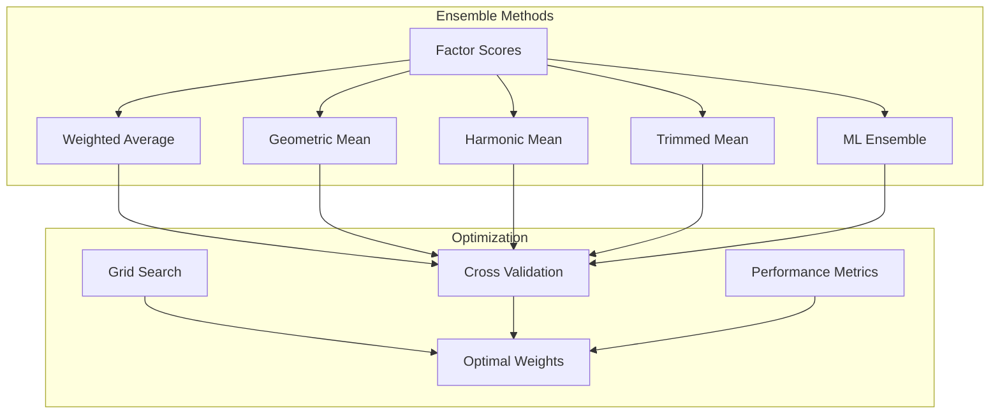

# 🔄 **Ensemble Methods**

This document explains the ensemble methods used in Ragify for combining multiple scoring factors and improving prediction accuracy.

## 🎯 **Overview**

Ensemble methods combine multiple scoring factors or models to produce more robust and accurate relevance scores than any single method alone.



## 🧮 **Ensemble Method Types**

### **1. Weighted Average**

```python
def calculate_weighted_average(scores, weights):
    """
    Calculate weighted average of scores.
    
    Args:
        scores: List of factor scores
        weights: List of weights for each score
    
    Returns:
        Weighted average score
    """
    if len(scores) != len(weights):
        raise ValueError("Scores and weights must have the same length")
    
    if not scores:
        return 0.0
    
    # Normalize weights
    total_weight = sum(weights)
    if total_weight == 0:
        return np.mean(scores)
    
    normalized_weights = [w / total_weight for w in weights]
    
    # Calculate weighted average
    weighted_sum = sum(score * weight for score, weight in zip(scores, normalized_weights))
    
    return weighted_sum

# Usage
factor_scores = [0.8, 0.7, 0.9, 0.6, 0.85]
factor_weights = [0.3, 0.2, 0.25, 0.15, 0.1]
weighted_score = calculate_weighted_average(factor_scores, factor_weights)
print(f"Weighted average: {weighted_score:.3f}")
```

### **2. Geometric Mean**

```python
import math

def calculate_geometric_mean(scores):
    """
    Calculate geometric mean of scores.
    
    Args:
        scores: List of factor scores
    
    Returns:
        Geometric mean score
    """
    if not scores:
        return 0.0
    
    # Filter out zero and negative scores
    positive_scores = [score for score in scores if score > 0]
    
    if not positive_scores:
        return 0.0
    
    # Calculate geometric mean
    log_sum = sum(math.log(score) for score in positive_scores)
    geometric_mean = math.exp(log_sum / len(positive_scores))
    
    return geometric_mean

# Usage
factor_scores = [0.8, 0.7, 0.9, 0.6, 0.85]
geometric_score = calculate_geometric_mean(factor_scores)
print(f"Geometric mean: {geometric_score:.3f}")
```

### **3. Harmonic Mean**

```python
def calculate_harmonic_mean(scores):
    """
    Calculate harmonic mean of scores.
    
    Args:
        scores: List of factor scores
    
    Returns:
        Harmonic mean score
    """
    if not scores:
        return 0.0
    
    # Filter out zero scores
    non_zero_scores = [score for score in scores if score > 0]
    
    if not non_zero_scores:
        return 0.0
    
    # Calculate harmonic mean
    reciprocal_sum = sum(1 / score for score in non_zero_scores)
    harmonic_mean = len(non_zero_scores) / reciprocal_sum
    
    return harmonic_mean

# Usage
factor_scores = [0.8, 0.7, 0.9, 0.6, 0.85]
harmonic_score = calculate_harmonic_mean(factor_scores)
print(f"Harmonic mean: {harmonic_score:.3f}")
```

### **4. Trimmed Mean**

```python
def calculate_trimmed_mean(scores, trim_percent=0.1):
    """
    Calculate trimmed mean of scores.
    
    Args:
        scores: List of factor scores
        trim_percent: Percentage to trim from each end
    
    Returns:
        Trimmed mean score
    """
    if len(scores) < 3:
        return np.mean(scores) if scores else 0.0
    
    # Sort scores
    sorted_scores = sorted(scores)
    
    # Calculate trim count
    trim_count = int(len(sorted_scores) * trim_percent)
    
    # Remove extreme values
    trimmed_scores = sorted_scores[trim_count:-trim_count]
    
    return np.mean(trimmed_scores)

# Usage
factor_scores = [0.8, 0.7, 0.9, 0.6, 0.85, 0.95, 0.5]
trimmed_score = calculate_trimmed_mean(factor_scores, trim_percent=0.1)
print(f"Trimmed mean: {trimmed_score:.3f}")
```

### **5. ML Ensemble**

```python
from sklearn.ensemble import RandomForestRegressor, GradientBoostingRegressor
from sklearn.linear_model import LinearRegression
from sklearn.model_selection import cross_val_score

class MLEnsemble:
    def __init__(self):
        self.models = {
            'random_forest': RandomForestRegressor(n_estimators=100, random_state=42),
            'gradient_boosting': GradientBoostingRegressor(n_estimators=100, random_state=42),
            'linear_regression': LinearRegression()
        }
        self.is_trained = False
        self.feature_names = []
    
    def train(self, X, y):
        """
        Train ensemble models.
        
        Args:
            X: Feature matrix
            y: Target values
        """
        self.feature_names = [f'factor_{i}' for i in range(X.shape[1])]
        
        for name, model in self.models.items():
            # Train model
            model.fit(X, y)
            
            # Cross-validation score
            cv_scores = cross_val_score(model, X, y, cv=5)
            print(f"{name} CV score: {cv_scores.mean():.3f} (+/- {cv_scores.std() * 2:.3f})")
        
        self.is_trained = True
    
    def predict(self, X):
        """
        Make ensemble prediction.
        
        Args:
            X: Feature matrix
        
        Returns:
            Ensemble prediction
        """
        if not self.is_trained:
            raise ValueError("Models must be trained before prediction")
        
        predictions = []
        for name, model in self.models.items():
            pred = model.predict(X)
            predictions.append(pred)
        
        # Average predictions
        ensemble_prediction = np.mean(predictions, axis=0)
        
        return ensemble_prediction
    
    def get_feature_importance(self):
        """
        Get feature importance from models.
        
        Returns:
            Dictionary of feature importance
        """
        importance_dict = {}
        
        for name, model in self.models.items():
            if hasattr(model, 'feature_importances_'):
                importance_dict[name] = dict(zip(self.feature_names, model.feature_importances_))
            elif hasattr(model, 'coef_'):
                importance_dict[name] = dict(zip(self.feature_names, np.abs(model.coef_)))
        
        return importance_dict

# Usage
# Prepare training data
X_train = np.array([
    [0.8, 0.7, 0.9, 0.6, 0.85],
    [0.7, 0.8, 0.6, 0.9, 0.75],
    [0.9, 0.6, 0.8, 0.7, 0.9],
    # ... more training examples
])
y_train = np.array([0.82, 0.76, 0.84])  # Target relevance scores

# Train ensemble
ensemble = MLEnsemble()
ensemble.train(X_train, y_train)

# Make prediction
X_new = np.array([[0.8, 0.7, 0.9, 0.6, 0.85]])
prediction = ensemble.predict(X_new)
print(f"Ensemble prediction: {prediction[0]:.3f}")

# Get feature importance
importance = ensemble.get_feature_importance()
print("Feature importance:", importance)
```

## 🔧 **Ensemble Optimization**

### **1. Weight Optimization**

```python
from sklearn.model_selection import GridSearchCV
from sklearn.metrics import mean_squared_error

class EnsembleOptimizer:
    def __init__(self, ensemble_methods):
        self.ensemble_methods = ensemble_methods
        self.optimal_weights = None
    
    def optimize_weights(self, X_train, y_train, X_val, y_val):
        """
        Optimize ensemble weights using grid search.
        
        Args:
            X_train: Training features
            y_train: Training targets
            X_val: Validation features
            y_val: Validation targets
        
        Returns:
            Optimal weights
        """
        # Generate weight combinations
        weight_combinations = self._generate_weight_combinations()
        
        best_score = float('inf')
        best_weights = None
        
        for weights in weight_combinations:
            # Calculate ensemble predictions
            ensemble_pred = self._ensemble_predict(X_val, weights)
            
            # Calculate validation score
            score = mean_squared_error(y_val, ensemble_pred)
            
            if score < best_score:
                best_score = score
                best_weights = weights
        
        self.optimal_weights = best_weights
        return best_weights
    
    def _generate_weight_combinations(self):
        """Generate weight combinations for grid search."""
        weight_values = [0.0, 0.1, 0.2, 0.3, 0.4, 0.5, 0.6, 0.7, 0.8, 0.9, 1.0]
        combinations = []
        
        for w1 in weight_values:
            for w2 in weight_values:
                for w3 in weight_values:
                    for w4 in weight_values:
                        w5 = 1.0 - (w1 + w2 + w3 + w4)
                        if 0.0 <= w5 <= 1.0:
                            combinations.append([w1, w2, w3, w4, w5])
        
        return combinations
    
    def _ensemble_predict(self, X, weights):
        """Make ensemble prediction with given weights."""
        predictions = []
        
        for method_name, method_func in self.ensemble_methods.items():
            pred = method_func(X)
            predictions.append(pred)
        
        # Weighted combination
        ensemble_pred = np.zeros_like(predictions[0])
        for i, (pred, weight) in enumerate(zip(predictions, weights)):
            ensemble_pred += weight * pred
        
        return ensemble_pred

# Usage
ensemble_methods = {
    'weighted_avg': lambda X: calculate_weighted_average(X, [0.3, 0.2, 0.25, 0.15, 0.1]),
    'geometric_mean': lambda X: calculate_geometric_mean(X),
    'harmonic_mean': lambda X: calculate_harmonic_mean(X),
    'trimmed_mean': lambda X: calculate_trimmed_mean(X),
    'ml_ensemble': lambda X: ml_ensemble.predict(X)
}

optimizer = EnsembleOptimizer(ensemble_methods)
optimal_weights = optimizer.optimize_weights(X_train, y_train, X_val, y_val)
print(f"Optimal weights: {optimal_weights}")
```

### **2. Cross-Validation**

```python
from sklearn.model_selection import KFold

def cross_validate_ensemble(ensemble_methods, X, y, n_splits=5):
    """
    Cross-validate ensemble methods.
    
    Args:
        ensemble_methods: Dictionary of ensemble methods
        X: Feature matrix
        y: Target values
        n_splits: Number of CV folds
    
    Returns:
        Cross-validation results
    """
    kf = KFold(n_splits=n_splits, shuffle=True, random_state=42)
    cv_results = {}
    
    for method_name, method_func in ensemble_methods.items():
        scores = []
        
        for train_idx, val_idx in kf.split(X):
            X_train_fold, X_val_fold = X[train_idx], X[val_idx]
            y_train_fold, y_val_fold = y[train_idx], y[val_idx]
            
            # Train method (if applicable)
            if hasattr(method_func, 'fit'):
                method_func.fit(X_train_fold, y_train_fold)
                pred = method_func.predict(X_val_fold)
            else:
                pred = method_func(X_val_fold)
            
            # Calculate score
            score = mean_squared_error(y_val_fold, pred)
            scores.append(score)
        
        cv_results[method_name] = {
            'mean_score': np.mean(scores),
            'std_score': np.std(scores),
            'scores': scores
        }
    
    return cv_results

# Usage
cv_results = cross_validate_ensemble(ensemble_methods, X, y)

for method_name, results in cv_results.items():
    print(f"{method_name}: {results['mean_score']:.3f} (+/- {results['std_score'] * 2:.3f})")
```

### **3. Dynamic Ensemble Selection**

```python
class DynamicEnsemble:
    def __init__(self, ensemble_methods):
        self.ensemble_methods = ensemble_methods
        self.method_performance = {}
    
    def select_best_method(self, X, y, validation_split=0.2):
        """
        Dynamically select the best ensemble method.
        
        Args:
            X: Feature matrix
            y: Target values
            validation_split: Fraction for validation
        
        Returns:
            Best ensemble method
        """
        # Split data
        split_idx = int(len(X) * (1 - validation_split))
        X_train, X_val = X[:split_idx], X[split_idx:]
        y_train, y_val = y[:split_idx], y[split_idx:]
        
        best_method = None
        best_score = float('inf')
        
        for method_name, method_func in self.ensemble_methods.items():
            try:
                # Train method (if applicable)
                if hasattr(method_func, 'fit'):
                    method_func.fit(X_train, y_train)
                    pred = method_func.predict(X_val)
                else:
                    pred = method_func(X_val)
                
                # Calculate score
                score = mean_squared_error(y_val, pred)
                
                if score < best_score:
                    best_score = score
                    best_method = method_name
                
                self.method_performance[method_name] = score
                
            except Exception as e:
                print(f"Error with method {method_name}: {e}")
                continue
        
        return best_method
    
    def adaptive_ensemble(self, X, y):
        """
        Use adaptive ensemble based on data characteristics.
        
        Args:
            X: Feature matrix
            y: Target values
        
        Returns:
            Ensemble prediction
        """
        # Analyze data characteristics
        data_stats = self._analyze_data(X, y)
        
        # Select method based on characteristics
        if data_stats['variance'] > 0.1:
            # High variance: use robust methods
            method_name = 'trimmed_mean'
        elif data_stats['skewness'] > 1.0:
            # Skewed data: use geometric mean
            method_name = 'geometric_mean'
        else:
            # Normal data: use weighted average
            method_name = 'weighted_avg'
        
        method_func = self.ensemble_methods[method_name]
        return method_func(X)
    
    def _analyze_data(self, X, y):
        """Analyze data characteristics."""
        return {
            'variance': np.var(y),
            'skewness': stats.skew(y),
            'kurtosis': stats.kurtosis(y),
            'sample_size': len(y)
        }

# Usage
dynamic_ensemble = DynamicEnsemble(ensemble_methods)
best_method = dynamic_ensemble.select_best_method(X, y)
print(f"Best method: {best_method}")

adaptive_pred = dynamic_ensemble.adaptive_ensemble(X, y)
print(f"Adaptive ensemble prediction: {adaptive_pred}")
```

## 📊 **Ensemble Evaluation**

### **1. Performance Comparison**

```python
def compare_ensemble_methods(ensemble_methods, X, y):
    """
    Compare performance of different ensemble methods.
    
    Args:
        ensemble_methods: Dictionary of ensemble methods
        X: Feature matrix
        y: Target values
    
    Returns:
        Performance comparison results
    """
    results = {}
    
    for method_name, method_func in ensemble_methods.items():
        try:
            # Make predictions
            if hasattr(method_func, 'fit'):
                method_func.fit(X, y)
                pred = method_func.predict(X)
            else:
                pred = method_func(X)
            
            # Calculate metrics
            mse = mean_squared_error(y, pred)
            mae = mean_absolute_error(y, pred)
            r2 = r2_score(y, pred)
            
            results[method_name] = {
                'mse': mse,
                'mae': mae,
                'r2': r2,
                'predictions': pred
            }
            
        except Exception as e:
            results[method_name] = {
                'error': str(e)
            }
    
    return results

# Usage
comparison_results = compare_ensemble_methods(ensemble_methods, X, y)

for method_name, results in comparison_results.items():
    if 'error' not in results:
        print(f"{method_name}:")
        print(f"  MSE: {results['mse']:.4f}")
        print(f"  MAE: {results['mae']:.4f}")
        print(f"  R²: {results['r2']:.4f}")
    else:
        print(f"{method_name}: Error - {results['error']}")
```

### **2. Stability Analysis**

```python
def analyze_ensemble_stability(ensemble_methods, X, y, n_bootstrap=100):
    """
    Analyze stability of ensemble methods.
    
    Args:
        ensemble_methods: Dictionary of ensemble methods
        X: Feature matrix
        y: Target values
        n_bootstrap: Number of bootstrap samples
    
    Returns:
        Stability analysis results
    """
    stability_results = {}
    
    for method_name, method_func in ensemble_methods.items():
        bootstrap_scores = []
        
        for _ in range(n_bootstrap):
            # Bootstrap sample
            indices = np.random.choice(len(X), size=len(X), replace=True)
            X_boot, y_boot = X[indices], y[indices]
            
            try:
                # Make prediction
                if hasattr(method_func, 'fit'):
                    method_func.fit(X_boot, y_boot)
                    pred = method_func.predict(X)
                else:
                    pred = method_func(X)
                
                # Calculate score
                score = mean_squared_error(y, pred)
                bootstrap_scores.append(score)
                
            except Exception:
                continue
        
        if bootstrap_scores:
            stability_results[method_name] = {
                'mean_score': np.mean(bootstrap_scores),
                'std_score': np.std(bootstrap_scores),
                'cv_score': np.std(bootstrap_scores) / np.mean(bootstrap_scores),
                'n_successful': len(bootstrap_scores)
            }
    
    return stability_results

# Usage
stability_results = analyze_ensemble_stability(ensemble_methods, X, y)

for method_name, results in stability_results.items():
    print(f"{method_name}:")
    print(f"  Mean Score: {results['mean_score']:.4f}")
    print(f"  Std Score: {results['std_score']:.4f}")
    print(f"  CV Score: {results['cv_score']:.4f}")
    print(f"  Success Rate: {results['n_successful']/100:.2%}")
```

## 🎯 **Practical Applications**

### **1. Multi-Method Ensemble**

```python
class MultiMethodEnsemble:
    def __init__(self):
        self.methods = {
            'weighted_avg': calculate_weighted_average,
            'geometric_mean': calculate_geometric_mean,
            'harmonic_mean': calculate_harmonic_mean,
            'trimmed_mean': calculate_trimmed_mean
        }
        self.weights = None
    
    def fit(self, X, y):
        """Fit ensemble weights."""
        # Optimize weights
        optimizer = EnsembleOptimizer(self.methods)
        self.weights = optimizer.optimize_weights(X, y, X, y)
    
    def predict(self, X):
        """Make ensemble prediction."""
        if self.weights is None:
            raise ValueError("Ensemble must be fitted before prediction")
        
        predictions = []
        for method_name, method_func in self.methods.items():
            pred = method_func(X)
            predictions.append(pred)
        
        # Weighted combination
        ensemble_pred = np.zeros_like(predictions[0])
        for pred, weight in zip(predictions, self.weights):
            ensemble_pred += weight * pred
        
        return ensemble_pred

# Usage
multi_ensemble = MultiMethodEnsemble()
multi_ensemble.fit(X_train, y_train)
prediction = multi_ensemble.predict(X_test)
print(f"Multi-method ensemble prediction: {prediction}")
```

### **2. Confidence-Weighted Ensemble**

```python
def confidence_weighted_ensemble(scores, confidences):
    """
    Weight ensemble by confidence scores.
    
    Args:
        scores: List of factor scores
        confidences: List of confidence scores
    
    Returns:
        Confidence-weighted ensemble score
    """
    if len(scores) != len(confidences):
        raise ValueError("Scores and confidences must have the same length")
    
    if not scores:
        return 0.0
    
    # Normalize confidences
    total_confidence = sum(confidences)
    if total_confidence == 0:
        return np.mean(scores)
    
    normalized_confidences = [c / total_confidence for c in confidences]
    
    # Weighted combination
    weighted_score = sum(score * conf for score, conf in zip(scores, normalized_confidences))
    
    return weighted_score

# Usage
factor_scores = [0.8, 0.7, 0.9, 0.6, 0.85]
confidence_scores = [0.9, 0.8, 0.95, 0.7, 0.85]
confidence_weighted_score = confidence_weighted_ensemble(factor_scores, confidence_scores)
print(f"Confidence-weighted score: {confidence_weighted_score:.3f}")
```

---

## 📚 **Next Steps**

- **[Scoring System](scoring.md)** - Multi-factor scoring with ensemble methods
- **[Confidence Bounds](confidence-bounds.md)** - Statistical confidence intervals
- **[API Reference](api-reference.md)** - Complete API documentation
- **[Configuration](configuration.md)** - Ensemble method configuration
