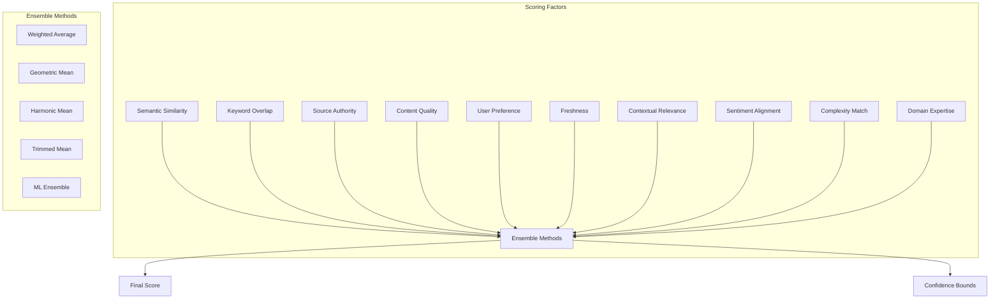

# 🎯 **Multi-Factor Scoring System**

This document explains Ragify's advanced multi-factor scoring system that calculates relevance scores using multiple factors and ensemble methods.

## 🎯 **Overview**

The scoring system evaluates context chunks using multiple factors and combines them using sophisticated ensemble methods to provide accurate relevance scores.



## 🧮 **Scoring Factors**

### **1. Semantic Similarity (30%)**

```python
async def calculate_semantic_similarity(chunk, query):
    """Calculate semantic similarity between chunk and query."""
    # Generate embeddings
    query_embedding = await generate_embedding(query)
    chunk_embedding = await generate_embedding(chunk.content)
    
    # Calculate cosine similarity
    similarity = cosine_similarity(query_embedding, chunk_embedding)
    
    return similarity

# Usage
semantic_score = await calculate_semantic_similarity(chunk, query)
```

### **2. Keyword Overlap (20%)**

```python
def calculate_keyword_overlap(chunk, query):
    """Calculate keyword overlap between chunk and query."""
    # Extract keywords
    query_keywords = extract_keywords(query)
    chunk_keywords = extract_keywords(chunk.content)
    
    # Calculate overlap
    intersection = set(query_keywords) & set(chunk_keywords)
    union = set(query_keywords) | set(chunk_keywords)
    
    # Jaccard similarity
    overlap_score = len(intersection) / len(union) if union else 0.0
    
    return overlap_score

def extract_keywords(text):
    """Extract keywords from text."""
    # Remove stop words and punctuation
    words = re.findall(r'\b\w+\b', text.lower())
    stop_words = set(['the', 'a', 'an', 'and', 'or', 'but', 'in', 'on', 'at', 'to', 'for', 'of', 'with', 'by'])
    
    keywords = [word for word in words if word not in stop_words and len(word) > 2]
    return keywords
```

### **3. Source Authority (15%)**

```python
def calculate_source_authority(chunk):
    """Calculate source authority score."""
    # Base authority scores by source type
    base_authority_scores = {
        SourceType.DOCUMENT: 0.7,
        SourceType.API: 0.8,
        SourceType.DATABASE: 0.9,
        SourceType.REALTIME: 0.6
    }
    
    base_score = base_authority_scores.get(chunk.source.source_type, 0.5)
    enhancement = 0.0
    
    # Domain authority enhancement
    if has_domain_authority(chunk.source):
        enhancement += 0.2
    
    # User ratings enhancement
    user_rating = get_user_rating(chunk.source)
    enhancement += user_rating * 0.1
    
    # Verification status enhancement
    if chunk.metadata.get('verified', False):
        enhancement += 0.1
    
    # Update frequency enhancement
    if has_recent_updates(chunk.source):
        enhancement += 0.05
    
    # Source name pattern enhancement
    if has_authoritative_name(chunk.source.name):
        enhancement += 0.05
    
    final_score = min(1.0, base_score + enhancement)
    return final_score

def has_domain_authority(source):
    """Check if source has domain authority."""
    authoritative_domains = [
        'official', 'gov', 'edu', 'research', 'expert', 'authority'
    ]
    
    return any(domain in source.name.lower() for domain in authoritative_domains)
```

### **4. Content Quality (10%)**

```python
def calculate_content_quality(chunk):
    """Calculate content quality score."""
    quality_score = 0.0
    
    # Length quality
    content_length = len(chunk.content)
    if 100 <= content_length <= 2000:
        quality_score += 0.3
    elif content_length > 2000:
        quality_score += 0.2
    
    # Readability quality
    readability_score = calculate_readability(chunk.content)
    quality_score += readability_score * 0.2
    
    # Structure quality
    if has_good_structure(chunk.content):
        quality_score += 0.2
    
    # Completeness quality
    if is_complete_content(chunk.content):
        quality_score += 0.2
    
    # Language quality
    language_score = assess_language_quality(chunk.content)
    quality_score += language_score * 0.1
    
    return min(1.0, quality_score)

def calculate_readability(text):
    """Calculate readability score using Flesch Reading Ease."""
    sentences = len(re.split(r'[.!?]+', text))
    words = len(text.split())
    syllables = count_syllables(text)
    
    if sentences == 0 or words == 0:
        return 0.0
    
    flesch_score = 206.835 - (1.015 * (words / sentences)) - (84.6 * (syllables / words))
    return max(0.0, min(1.0, flesch_score / 100))
```

### **5. User Preference (10%)**

```python
async def calculate_user_preference(chunk, user_id):
    """Calculate user preference score."""
    if not user_id:
        return 0.5
    
    user_history = await get_user_interaction_history(user_id)
    
    preference_score = 0.5  # Neutral baseline
    
    # Source preference
    source_preference = get_source_preference(user_history, chunk.source)
    preference_score += source_preference * 0.3
    
    # Content type preference
    content_preference = get_content_type_preference(user_history, chunk)
    preference_score += content_preference * 0.2
    
    # Topic preference
    topic_preference = get_topic_preference(user_history, chunk)
    preference_score += topic_preference * 0.3
    
    # Recent interaction boost
    recent_boost = get_recent_interaction_boost(user_history, chunk.source)
    preference_score += recent_boost * 0.2
    
    return min(1.0, max(0.0, preference_score))

async def get_user_interaction_history(user_id):
    """Get user interaction history."""
    # In a real implementation, this would query a database
    # For now, return simulated history
    return {
        'sources': {'api_source': 0.8, 'doc_source': 0.6},
        'content_types': {'technical': 0.7, 'general': 0.5},
        'topics': {'machine_learning': 0.9, 'python': 0.8},
        'recent_interactions': [
            {'source': 'api_source', 'timestamp': datetime.now() - timedelta(hours=2)}
        ]
    }
```

### **6. Freshness (5%)**

```python
def calculate_freshness(chunk):
    """Calculate content freshness score."""
    # Get content timestamp
    timestamp = chunk.metadata.get('timestamp', chunk.metadata.get('created_at'))
    
    if not timestamp:
        return 0.5  # Neutral if no timestamp
    
    # Convert to datetime if string
    if isinstance(timestamp, str):
        timestamp = datetime.fromisoformat(timestamp.replace('Z', '+00:00'))
    
    # Calculate age
    age = datetime.now(timestamp.tzinfo) - timestamp
    
    # Calculate freshness score (exponential decay)
    days_old = age.days
    freshness_score = math.exp(-days_old / 365)  # Decay over 1 year
    
    return max(0.1, freshness_score)  # Minimum 10% freshness
```

### **7. Contextual Relevance (5%)**

```python
async def calculate_contextual_relevance(chunk, query, context_chunks):
    """Calculate contextual relevance score."""
    if not context_chunks:
        return 0.5
    
    # Calculate context factor
    context_factor = await calculate_context_factor(chunk, context_chunks)
    
    # Calculate query-context alignment
    query_context_alignment = calculate_query_context_alignment(query, context_chunks)
    
    # Combine factors
    contextual_score = (context_factor + query_context_alignment) / 2
    
    return contextual_score

async def calculate_context_factor(chunk, context_chunks):
    """Calculate how well chunk fits with existing context."""
    if not context_chunks:
        return 0.5
    
    # Calculate average similarity with context chunks
    similarities = []
    for context_chunk in context_chunks:
        similarity = await calculate_semantic_similarity(chunk, context_chunk.content)
        similarities.append(similarity)
    
    return np.mean(similarities) if similarities else 0.5
```

### **8. Sentiment Alignment (2%)**

```python
def calculate_sentiment_alignment(chunk, query):
    """Calculate sentiment alignment between chunk and query."""
    # Analyze sentiment
    chunk_sentiment = analyze_sentiment(chunk.content)
    query_sentiment = analyze_sentiment(query)
    
    # Calculate alignment
    sentiment_diff = abs(chunk_sentiment - query_sentiment)
    alignment_score = 1.0 - sentiment_diff
    
    return max(0.0, alignment_score)

def analyze_sentiment(text):
    """Simple sentiment analysis (use proper NLP library in production)."""
    positive_words = ['good', 'great', 'excellent', 'amazing', 'wonderful', 'best']
    negative_words = ['bad', 'terrible', 'awful', 'worst', 'horrible', 'poor']
    
    words = text.lower().split()
    positive_count = sum(1 for word in words if word in positive_words)
    negative_count = sum(1 for word in words if word in negative_words)
    
    total_words = len(words)
    if total_words == 0:
        return 0.5
    
    sentiment_score = (positive_count - negative_count) / total_words
    return (sentiment_score + 1) / 2  # Normalize to 0-1
```

### **9. Complexity Match (2%)**

```python
def calculate_complexity_match(chunk, user_context):
    """Calculate complexity match with user's expertise level."""
    user_expertise = user_context.get('expertise_level', 'intermediate')
    content_complexity = assess_content_complexity(chunk.content)
    
    # Define complexity levels
    complexity_levels = {
        'beginner': 0.3,
        'intermediate': 0.6,
        'advanced': 0.9
    }
    
    target_complexity = complexity_levels.get(user_expertise, 0.6)
    complexity_diff = abs(content_complexity - target_complexity)
    
    # Higher score for better match
    match_score = 1.0 - complexity_diff
    
    return max(0.0, match_score)

def assess_content_complexity(text):
    """Assess content complexity level."""
    # Simple complexity assessment
    words = text.split()
    avg_word_length = np.mean([len(word) for word in words])
    
    # Sentence complexity
    sentences = re.split(r'[.!?]+', text)
    avg_sentence_length = np.mean([len(s.split()) for s in sentences if s.strip()])
    
    # Technical term density
    technical_terms = count_technical_terms(text)
    term_density = technical_terms / len(words) if words else 0
    
    # Combine factors
    complexity_score = (
        (avg_word_length / 10) * 0.3 +
        (avg_sentence_length / 20) * 0.3 +
        (term_density * 10) * 0.4
    )
    
    return min(1.0, complexity_score)
```

### **10. Domain Expertise (1%)**

```python
def calculate_domain_expertise(chunk, query):
    """Calculate domain expertise relevance."""
    # Extract domains
    chunk_domains = extract_domains(chunk.content)
    query_domains = extract_domains(query)
    
    # Calculate domain overlap
    domain_overlap = len(set(chunk_domains) & set(query_domains))
    total_domains = len(set(chunk_domains) | set(query_domains))
    
    if total_domains == 0:
        return 0.5
    
    expertise_score = domain_overlap / total_domains
    
    # Boost for specialized domains
    if is_specialized_domain(chunk_domains):
        expertise_score *= 1.2
    
    return min(1.0, expertise_score)

def extract_domains(text):
    """Extract domain keywords from text."""
    domain_keywords = {
        'machine_learning': ['ml', 'ai', 'neural', 'algorithm', 'model'],
        'programming': ['code', 'program', 'software', 'development'],
        'data_science': ['data', 'analysis', 'statistics', 'visualization'],
        'business': ['strategy', 'market', 'finance', 'management']
    }
    
    text_lower = text.lower()
    domains = []
    
    for domain, keywords in domain_keywords.items():
        if any(keyword in text_lower for keyword in keywords):
            domains.append(domain)
    
    return domains
```

## 🔄 **Ensemble Methods**

### **1. Weighted Average**

```python
def calculate_weighted_average_scores(factor_scores, weights):
    """Calculate weighted average of factor scores."""
    weighted_sum = sum(score * weight for score, weight in zip(factor_scores, weights))
    total_weight = sum(weights)
    
    return weighted_sum / total_weight if total_weight > 0 else 0.0

# Default weights
DEFAULT_WEIGHTS = {
    'semantic_similarity': 0.30,
    'keyword_overlap': 0.20,
    'source_authority': 0.15,
    'content_quality': 0.10,
    'user_preference': 0.10,
    'freshness': 0.05,
    'contextual_relevance': 0.05,
    'sentiment_alignment': 0.02,
    'complexity_match': 0.02,
    'domain_expertise': 0.01
}
```

### **2. Geometric Mean**

```python
def calculate_geometric_mean_scores(factor_scores):
    """Calculate geometric mean of factor scores."""
    # Filter out zero scores to avoid log(0)
    non_zero_scores = [score for score in factor_scores if score > 0]
    
    if not non_zero_scores:
        return 0.0
    
    # Calculate geometric mean
    log_sum = sum(math.log(score) for score in non_zero_scores)
    geometric_mean = math.exp(log_sum / len(non_zero_scores))
    
    return geometric_mean
```

### **3. Harmonic Mean**

```python
def calculate_harmonic_mean_scores(factor_scores):
    """Calculate harmonic mean of factor scores."""
    # Filter out zero scores to avoid division by zero
    non_zero_scores = [score for score in factor_scores if score > 0]
    
    if not non_zero_scores:
        return 0.0
    
    # Calculate harmonic mean
    reciprocal_sum = sum(1 / score for score in non_zero_scores)
    harmonic_mean = len(non_zero_scores) / reciprocal_sum
    
    return harmonic_mean
```

### **4. Trimmed Mean**

```python
def calculate_trimmed_mean_scores(factor_scores, trim_percent=0.1):
    """Calculate trimmed mean of factor scores."""
    if len(factor_scores) < 3:
        return np.mean(factor_scores)
    
    # Sort scores
    sorted_scores = sorted(factor_scores)
    
    # Calculate trim count
    trim_count = int(len(sorted_scores) * trim_percent)
    
    # Remove extreme values
    trimmed_scores = sorted_scores[trim_count:-trim_count]
    
    return np.mean(trimmed_scores)
```

### **5. ML Ensemble**

```python
class MLEnsembleScorer:
    def __init__(self):
        self.model = None
        self.is_trained = False
    
    async def train_ensemble(self, training_data):
        """Train ML ensemble model."""
        # Prepare training data
        X = []
        y = []
        
        for data_point in training_data:
            features = self.extract_features(data_point['chunk'], data_point['query'])
            X.append(features)
            y.append(data_point['relevance_score'])
        
        # Train model (using Random Forest as example)
        from sklearn.ensemble import RandomForestRegressor
        self.model = RandomForestRegressor(n_estimators=100, random_state=42)
        self.model.fit(X, y)
        self.is_trained = True
    
    def extract_features(self, chunk, query):
        """Extract features for ML model."""
        features = []
        
        # Add all factor scores as features
        factor_scores = self.calculate_all_factors(chunk, query)
        features.extend(factor_scores.values())
        
        # Add metadata features
        features.append(len(chunk.content))
        features.append(chunk.metadata.get('word_count', 0))
        features.append(chunk.metadata.get('sentence_count', 0))
        
        return features
    
    async def predict_score(self, chunk, query):
        """Predict score using trained model."""
        if not self.is_trained:
            raise ValueError("Model must be trained before prediction")
        
        features = self.extract_features(chunk, query)
        predicted_score = self.model.predict([features])[0]
        
        return max(0.0, min(1.0, predicted_score))
```

## 📊 **Confidence Bounds**

### **1. Statistical Confidence Intervals**

```python
def calculate_confidence_bounds(scores, confidence_level=0.95):
    """Calculate confidence bounds for scores."""
    if len(scores) < 2:
        return 0.0, 1.0
    
    # Calculate mean and standard error
    mean_score = np.mean(scores)
    std_error = np.std(scores) / np.sqrt(len(scores))
    
    # Calculate confidence interval
    from scipy import stats
    confidence_interval = stats.t.interval(
        confidence_level, 
        len(scores) - 1, 
        loc=mean_score, 
        scale=std_error
    )
    
    return confidence_interval[0], confidence_interval[1]
```

### **2. Bootstrap Confidence Intervals**

```python
def calculate_bootstrap_confidence(scores, n_bootstrap=1000, confidence_level=0.95):
    """Calculate bootstrap confidence intervals."""
    if len(scores) < 2:
        return 0.0, 1.0
    
    # Generate bootstrap samples
    bootstrap_means = []
    for _ in range(n_bootstrap):
        bootstrap_sample = np.random.choice(scores, size=len(scores), replace=True)
        bootstrap_means.append(np.mean(bootstrap_sample))
    
    # Calculate confidence bounds
    lower_percentile = (1 - confidence_level) / 2 * 100
    upper_percentile = (1 + confidence_level) / 2 * 100
    
    lower_bound = np.percentile(bootstrap_means, lower_percentile)
    upper_bound = np.percentile(bootstrap_means, upper_percentile)
    
    return lower_bound, upper_bound
```

## 🎯 **Complete Scoring System**

```python
class MultiFactorScoringEngine:
    def __init__(self, weights=None, ensemble_method='weighted_average'):
        self.weights = weights or DEFAULT_WEIGHTS
        self.ensemble_method = ensemble_method
        self.ml_ensemble = MLEnsembleScorer()
    
    async def calculate_score(self, chunk, query, user_context=None):
        """Calculate comprehensive relevance score."""
        # Calculate all factor scores
        factor_scores = await self.calculate_all_factors(chunk, query, user_context)
        
        # Apply ensemble method
        final_score = self.apply_ensemble_method(factor_scores)
        
        # Calculate confidence bounds
        confidence_bounds = self.calculate_confidence_bounds(list(factor_scores.values()))
        
        return {
            'score': final_score,
            'confidence_lower': confidence_bounds[0],
            'confidence_upper': confidence_bounds[1],
            'factors': factor_scores
        }
    
    async def calculate_all_factors(self, chunk, query, user_context=None):
        """Calculate all factor scores."""
        return {
            'semantic_similarity': await calculate_semantic_similarity(chunk, query),
            'keyword_overlap': calculate_keyword_overlap(chunk, query),
            'source_authority': calculate_source_authority(chunk),
            'content_quality': calculate_content_quality(chunk),
            'user_preference': await calculate_user_preference(chunk, user_context.get('user_id') if user_context else None),
            'freshness': calculate_freshness(chunk),
            'contextual_relevance': await calculate_contextual_relevance(chunk, query, user_context.get('context_chunks', [])),
            'sentiment_alignment': calculate_sentiment_alignment(chunk, query),
            'complexity_match': calculate_complexity_match(chunk, user_context or {}),
            'domain_expertise': calculate_domain_expertise(chunk, query)
        }
    
    def apply_ensemble_method(self, factor_scores):
        """Apply ensemble method to combine factor scores."""
        scores = list(factor_scores.values())
        weights = list(self.weights.values())
        
        if self.ensemble_method == 'weighted_average':
            return calculate_weighted_average_scores(scores, weights)
        elif self.ensemble_method == 'geometric_mean':
            return calculate_geometric_mean_scores(scores)
        elif self.ensemble_method == 'harmonic_mean':
            return calculate_harmonic_mean_scores(scores)
        elif self.ensemble_method == 'trimmed_mean':
            return calculate_trimmed_mean_scores(scores)
        else:
            return calculate_weighted_average_scores(scores, weights)
```

## 🚀 **Best Practices**

### **1. Weight Optimization**

```python
def optimize_weights(training_data, validation_data):
    """Optimize factor weights using grid search."""
    from sklearn.model_selection import GridSearchCV
    from sklearn.ensemble import RandomForestRegressor
    
    # Define weight combinations to try
    weight_combinations = [
        {'semantic_similarity': 0.3, 'keyword_overlap': 0.2, 'source_authority': 0.15},
        {'semantic_similarity': 0.4, 'keyword_overlap': 0.15, 'source_authority': 0.15},
        {'semantic_similarity': 0.25, 'keyword_overlap': 0.25, 'source_authority': 0.15},
    ]
    
    best_score = 0.0
    best_weights = None
    
    for weights in weight_combinations:
        scorer = MultiFactorScoringEngine(weights=weights)
        score = evaluate_scorer(scorer, validation_data)
        
        if score > best_score:
            best_score = score
            best_weights = weights
    
    return best_weights
```

### **2. Dynamic Weight Adjustment**

```python
def adjust_weights_dynamically(factor_scores, query_type):
    """Adjust weights based on query type."""
    base_weights = DEFAULT_WEIGHTS.copy()
    
    if query_type == 'factual':
        # Increase authority and quality weights
        base_weights['source_authority'] *= 1.5
        base_weights['content_quality'] *= 1.3
    elif query_type == 'opinion':
        # Increase user preference weight
        base_weights['user_preference'] *= 1.5
    elif query_type == 'time_sensitive':
        # Increase freshness weight
        base_weights['freshness'] *= 2.0
    
    # Normalize weights
    total_weight = sum(base_weights.values())
    normalized_weights = {k: v / total_weight for k, v in base_weights.items()}
    
    return normalized_weights
```

---

## 📚 **Next Steps**

- **[Confidence Bounds](confidence-bounds.md)** - Statistical confidence intervals
- **[Ensemble Methods](ensemble-methods.md)** - Advanced ensemble techniques
- **[API Reference](api-reference.md)** - Complete API documentation
- **[Configuration](configuration.md)** - Scoring system configuration
