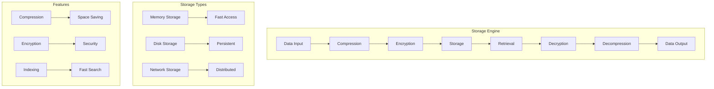

# 🗄️ **Storage Engine**

This document explains how Ragify's storage engine handles data compression, encryption, and persistence.

## 🎯 **Overview**

The storage engine provides efficient data storage with compression, encryption, and optimized retrieval mechanisms.



## 📦 **Storage Components**

### **1. Data Compression**

```python
import gzip
import zlib
import lz4
from ragify.storage import StorageEngine

class CompressionEngine:
    def __init__(self, algorithm='gzip'):
        self.algorithm = algorithm
        self.compression_level = 6
    
    def compress_data(self, data: bytes) -> bytes:
        """Compress data using specified algorithm."""
        if self.algorithm == 'gzip':
            return gzip.compress(data, compresslevel=self.compression_level)
        elif self.algorithm == 'zlib':
            return zlib.compress(data, level=self.compression_level)
        elif self.algorithm == 'lz4':
            return lz4.frame.compress(data)
        else:
            raise ValueError(f"Unsupported compression algorithm: {self.algorithm}")
    
    def decompress_data(self, compressed_data: bytes) -> bytes:
        """Decompress data using specified algorithm."""
        if self.algorithm == 'gzip':
            return gzip.decompress(compressed_data)
        elif self.algorithm == 'zlib':
            return zlib.decompress(compressed_data)
        elif self.algorithm == 'lz4':
            return lz4.frame.decompress(compressed_data)
        else:
            raise ValueError(f"Unsupported compression algorithm: {self.algorithm}")
    
    def get_compression_ratio(self, original_data: bytes, compressed_data: bytes) -> float:
        """Calculate compression ratio."""
        return len(compressed_data) / len(original_data)

# Usage
compression_engine = CompressionEngine(algorithm='gzip')
original_data = b"This is some test data that will be compressed"
compressed_data = compression_engine.compress_data(original_data)
decompressed_data = compression_engine.decompress_data(compressed_data)

compression_ratio = compression_engine.get_compression_ratio(original_data, compressed_data)
print(f"Compression ratio: {compression_ratio:.2f}")
```

### **2. Data Encryption**

```python
from cryptography.fernet import Fernet
from cryptography.hazmat.primitives import hashes
from cryptography.hazmat.primitives.kdf.pbkdf2 import PBKDF2HMAC
import base64

class EncryptionEngine:
    def __init__(self, key: str = None):
        if key:
            self.key = self._derive_key(key)
        else:
            self.key = Fernet.generate_key()
        
        self.cipher = Fernet(self.key)
    
    def _derive_key(self, password: str) -> bytes:
        """Derive encryption key from password."""
        salt = b'ragify_salt_123'  # In production, use random salt
        kdf = PBKDF2HMAC(
            algorithm=hashes.SHA256(),
            length=32,
            salt=salt,
            iterations=100000,
        )
        key = base64.urlsafe_b64encode(kdf.derive(password.encode()))
        return key
    
    def encrypt_data(self, data: bytes) -> bytes:
        """Encrypt data."""
        return self.cipher.encrypt(data)
    
    def decrypt_data(self, encrypted_data: bytes) -> bytes:
        """Decrypt data."""
        return self.cipher.decrypt(encrypted_data)
    
    def get_key(self) -> str:
        """Get encryption key as string."""
        return self.key.decode()

# Usage
encryption_engine = EncryptionEngine(key="my_secret_password")
sensitive_data = b"This is sensitive information"
encrypted_data = encryption_engine.encrypt_data(sensitive_data)
decrypted_data = encryption_engine.decrypt_data(encrypted_data)

print(f"Original: {sensitive_data}")
print(f"Encrypted: {encrypted_data[:50]}...")
print(f"Decrypted: {decrypted_data}")
```

### **3. Storage Engine**

```python
import asyncio
import aiofiles
from pathlib import Path
from typing import Optional, Dict, Any

class StorageEngine:
    def __init__(self, storage_path: str = "./storage", 
                 compression: bool = True, 
                 encryption: bool = False,
                 encryption_key: str = None):
        self.storage_path = Path(storage_path)
        self.storage_path.mkdir(parents=True, exist_ok=True)
        
        self.compression = compression
        self.encryption = encryption
        
        if compression:
            self.compression_engine = CompressionEngine()
        
        if encryption:
            self.encryption_engine = EncryptionEngine(encryption_key)
    
    async def store_data(self, key: str, data: Any, metadata: Dict = None) -> bool:
        """Store data with compression and encryption."""
        try:
            # Serialize data
            serialized_data = self._serialize_data(data)
            
            # Compress if enabled
            if self.compression:
                serialized_data = self.compression_engine.compress_data(serialized_data)
            
            # Encrypt if enabled
            if self.encryption:
                serialized_data = self.encryption_engine.encrypt_data(serialized_data)
            
            # Store data
            file_path = self.storage_path / f"{key}.dat"
            async with aiofiles.open(file_path, 'wb') as f:
                await f.write(serialized_data)
            
            # Store metadata
            if metadata:
                metadata_path = self.storage_path / f"{key}.meta"
                async with aiofiles.open(metadata_path, 'w') as f:
                    await f.write(json.dumps(metadata))
            
            return True
        except Exception as e:
            print(f"Error storing data: {e}")
            return False
    
    async def retrieve_data(self, key: str) -> Optional[Any]:
        """Retrieve data with decompression and decryption."""
        try:
            file_path = self.storage_path / f"{key}.dat"
            
            if not file_path.exists():
                return None
            
            # Read data
            async with aiofiles.open(file_path, 'rb') as f:
                data = await f.read()
            
            # Decrypt if enabled
            if self.encryption:
                data = self.encryption_engine.decrypt_data(data)
            
            # Decompress if enabled
            if self.compression:
                data = self.compression_engine.decompress_data(data)
            
            # Deserialize data
            return self._deserialize_data(data)
        except Exception as e:
            print(f"Error retrieving data: {e}")
            return None
    
    async def delete_data(self, key: str) -> bool:
        """Delete stored data."""
        try:
            file_path = self.storage_path / f"{key}.dat"
            metadata_path = self.storage_path / f"{key}.meta"
            
            if file_path.exists():
                file_path.unlink()
            
            if metadata_path.exists():
                metadata_path.unlink()
            
            return True
        except Exception as e:
            print(f"Error deleting data: {e}")
            return False
    
    async def list_keys(self) -> list:
        """List all stored keys."""
        keys = []
        for file_path in self.storage_path.glob("*.dat"):
            key = file_path.stem
            keys.append(key)
        return keys
    
    def _serialize_data(self, data: Any) -> bytes:
        """Serialize data to bytes."""
        return pickle.dumps(data)
    
    def _deserialize_data(self, data: bytes) -> Any:
        """Deserialize data from bytes."""
        return pickle.loads(data)

# Usage
storage_engine = StorageEngine(
    storage_path="./data_storage",
    compression=True,
    encryption=True,
    encryption_key="my_secret_key"
)

# Store data
data = {"name": "John", "age": 30, "city": "New York"}
metadata = {"created_at": "2024-01-01", "version": "1.0"}
await storage_engine.store_data("user:123", data, metadata)

# Retrieve data
retrieved_data = await storage_engine.retrieve_data("user:123")
print(f"Retrieved: {retrieved_data}")

# List all keys
keys = await storage_engine.list_keys()
print(f"Stored keys: {keys}")
```

## 🔧 **Storage Configuration**

### **1. Storage Policies**

```python
from dataclasses import dataclass
from typing import Optional

@dataclass
class StoragePolicy:
    compression: bool = True
    compression_algorithm: str = 'gzip'
    compression_level: int = 6
    encryption: bool = False
    encryption_key: Optional[str] = None
    max_file_size: int = 100 * 1024 * 1024  # 100MB
    retention_days: int = 365
    backup_enabled: bool = True
    backup_interval_hours: int = 24

class StorageManager:
    def __init__(self):
        self.policies = {
            'user_data': StoragePolicy(
                compression=True,
                encryption=True,
                retention_days=2555,  # 7 years
                backup_enabled=True
            ),
            'cache_data': StoragePolicy(
                compression=True,
                encryption=False,
                retention_days=30,
                backup_enabled=False
            ),
            'log_data': StoragePolicy(
                compression=True,
                encryption=False,
                retention_days=90,
                backup_enabled=True
            )
        }
    
    def get_policy(self, data_type: str) -> StoragePolicy:
        """Get storage policy for data type."""
        return self.policies.get(data_type, StoragePolicy())
    
    def create_storage_engine(self, data_type: str, storage_path: str) -> StorageEngine:
        """Create storage engine with appropriate policy."""
        policy = self.get_policy(data_type)
        
        return StorageEngine(
            storage_path=storage_path,
            compression=policy.compression,
            encryption=policy.encryption,
            encryption_key=policy.encryption_key
        )

# Usage
storage_manager = StorageManager()

# Create storage engines for different data types
user_storage = storage_manager.create_storage_engine('user_data', './user_storage')
cache_storage = storage_manager.create_storage_engine('cache_data', './cache_storage')
log_storage = storage_manager.create_storage_engine('log_data', './log_storage')
```

### **2. Storage Optimization**

```python
class StorageOptimizer:
    def __init__(self, storage_engine: StorageEngine):
        self.storage_engine = storage_engine
    
    async def optimize_storage(self):
        """Optimize storage performance and space usage."""
        # Analyze storage usage
        usage_stats = await self.analyze_storage_usage()
        
        # Optimize compression
        if usage_stats['compression_ratio'] > 0.8:
            await self.optimize_compression()
        
        # Clean up old data
        if usage_stats['old_files_count'] > 0:
            await self.cleanup_old_data()
        
        # Defragment storage
        if usage_stats['fragmentation_ratio'] > 0.3:
            await self.defragment_storage()
    
    async def analyze_storage_usage(self) -> Dict[str, Any]:
        """Analyze storage usage patterns."""
        keys = await self.storage_engine.list_keys()
        total_size = 0
        compressed_size = 0
        old_files_count = 0
        
        for key in keys:
            file_path = self.storage_engine.storage_path / f"{key}.dat"
            if file_path.exists():
                file_size = file_path.stat().st_size
                total_size += file_size
                
                # Check if file is old
                file_age = time.time() - file_path.stat().st_mtime
                if file_age > 30 * 24 * 3600:  # 30 days
                    old_files_count += 1
        
        return {
            'total_files': len(keys),
            'total_size': total_size,
            'compression_ratio': compressed_size / total_size if total_size > 0 else 1.0,
            'old_files_count': old_files_count,
            'fragmentation_ratio': 0.1  # Simplified calculation
        }
    
    async def optimize_compression(self):
        """Optimize compression settings."""
        # Recompress files with better settings
        keys = await self.storage_engine.list_keys()
        
        for key in keys:
            data = await self.storage_engine.retrieve_data(key)
            if data:
                # Recompress with optimized settings
                await self.storage_engine.store_data(key, data)
    
    async def cleanup_old_data(self, max_age_days: int = 30):
        """Clean up old data files."""
        keys = await self.storage_engine.list_keys()
        current_time = time.time()
        
        for key in keys:
            file_path = self.storage_engine.storage_path / f"{key}.dat"
            if file_path.exists():
                file_age = current_time - file_path.stat().st_mtime
                if file_age > max_age_days * 24 * 3600:
                    await self.storage_engine.delete_data(key)

# Usage
optimizer = StorageOptimizer(storage_engine)
await optimizer.optimize_storage()
```

## 📊 **Storage Monitoring**

### **1. Storage Metrics**

```python
class StorageMonitor:
    def __init__(self, storage_engine: StorageEngine):
        self.storage_engine = storage_engine
        self.metrics = {
            'total_operations': 0,
            'read_operations': 0,
            'write_operations': 0,
            'delete_operations': 0,
            'total_data_size': 0,
            'compression_savings': 0
        }
    
    async def get_storage_metrics(self) -> Dict[str, Any]:
        """Get comprehensive storage metrics."""
        keys = await self.storage_engine.list_keys()
        
        # Calculate storage statistics
        total_size = 0
        file_count = 0
        
        for key in keys:
            file_path = self.storage_engine.storage_path / f"{key}.dat"
            if file_path.exists():
                file_size = file_path.stat().st_size
                total_size += file_size
                file_count += 1
        
        # Calculate compression savings
        compression_savings = 0
        if self.storage_engine.compression:
            # Estimate compression savings
            compression_savings = total_size * 0.3  # Assume 30% savings
        
        return {
            'total_files': file_count,
            'total_size_bytes': total_size,
            'total_size_mb': total_size / (1024 * 1024),
            'compression_savings_mb': compression_savings / (1024 * 1024),
            'average_file_size': total_size / file_count if file_count > 0 else 0,
            'operations': self.metrics.copy()
        }
    
    async def monitor_storage_health(self) -> Dict[str, Any]:
        """Monitor storage health and performance."""
        metrics = await self.get_storage_metrics()
        
        # Calculate health score
        health_score = 100
        
        # Check disk space
        disk_usage = shutil.disk_usage(self.storage_engine.storage_path)
        disk_usage_percent = (disk_usage.used / disk_usage.total) * 100
        
        if disk_usage_percent > 90:
            health_score -= 30
        elif disk_usage_percent > 80:
            health_score -= 15
        
        # Check file fragmentation
        if metrics['total_files'] > 1000:
            health_score -= 10
        
        # Check compression efficiency
        if metrics['compression_savings_mb'] < metrics['total_size_mb'] * 0.1:
            health_score -= 10
        
        return {
            'health_score': max(0, health_score),
            'disk_usage_percent': disk_usage_percent,
            'metrics': metrics,
            'recommendations': self._generate_recommendations(metrics, disk_usage_percent)
        }
    
    def _generate_recommendations(self, metrics: Dict, disk_usage: float) -> list:
        """Generate storage recommendations."""
        recommendations = []
        
        if disk_usage > 90:
            recommendations.append("Critical: Disk space is nearly full. Consider cleanup or expansion.")
        elif disk_usage > 80:
            recommendations.append("Warning: Disk usage is high. Consider cleanup.")
        
        if metrics['total_files'] > 1000:
            recommendations.append("Consider archiving old files to reduce fragmentation.")
        
        if metrics['compression_savings_mb'] < metrics['total_size_mb'] * 0.1:
            recommendations.append("Compression efficiency is low. Consider recompressing with better settings.")
        
        return recommendations

# Usage
monitor = StorageMonitor(storage_engine)
metrics = await monitor.get_storage_metrics()
health = await monitor.monitor_storage_health()

print(f"Storage health score: {health['health_score']}")
print(f"Disk usage: {health['disk_usage_percent']:.1f}%")
print("Recommendations:")
for rec in health['recommendations']:
    print(f"  - {rec}")
```

### **2. Storage Backup**

```python
class StorageBackup:
    def __init__(self, storage_engine: StorageEngine, backup_path: str):
        self.storage_engine = storage_engine
        self.backup_path = Path(backup_path)
        self.backup_path.mkdir(parents=True, exist_ok=True)
    
    async def create_backup(self, backup_name: str = None) -> str:
        """Create a backup of all stored data."""
        if not backup_name:
            backup_name = f"backup_{int(time.time())}"
        
        backup_dir = self.backup_path / backup_name
        backup_dir.mkdir(exist_ok=True)
        
        keys = await self.storage_engine.list_keys()
        
        for key in keys:
            data = await self.storage_engine.retrieve_data(key)
            if data:
                # Store in backup
                backup_file = backup_dir / f"{key}.dat"
                async with aiofiles.open(backup_file, 'wb') as f:
                    serialized_data = pickle.dumps(data)
                    await f.write(serialized_data)
        
        # Create backup manifest
        manifest = {
            'backup_name': backup_name,
            'created_at': time.time(),
            'file_count': len(keys),
            'keys': keys
        }
        
        manifest_file = backup_dir / 'manifest.json'
        async with aiofiles.open(manifest_file, 'w') as f:
            await f.write(json.dumps(manifest, indent=2))
        
        return str(backup_dir)
    
    async def restore_backup(self, backup_name: str) -> bool:
        """Restore data from backup."""
        backup_dir = self.backup_path / backup_name
        
        if not backup_dir.exists():
            print(f"Backup {backup_name} not found")
            return False
        
        # Read manifest
        manifest_file = backup_dir / 'manifest.json'
        async with aiofiles.open(manifest_file, 'r') as f:
            manifest_content = await f.read()
            manifest = json.loads(manifest_content)
        
        # Restore files
        for key in manifest['keys']:
            backup_file = backup_dir / f"{key}.dat"
            if backup_file.exists():
                async with aiofiles.open(backup_file, 'rb') as f:
                    data = await f.read()
                    restored_data = pickle.loads(data)
                    await self.storage_engine.store_data(key, restored_data)
        
        return True
    
    async def list_backups(self) -> list:
        """List available backups."""
        backups = []
        for backup_dir in self.backup_path.iterdir():
            if backup_dir.is_dir():
                manifest_file = backup_dir / 'manifest.json'
                if manifest_file.exists():
                    async with aiofiles.open(manifest_file, 'r') as f:
                        manifest_content = await f.read()
                        manifest = json.loads(manifest_content)
                        backups.append(manifest)
        return backups

# Usage
backup_manager = StorageBackup(storage_engine, './backups')

# Create backup
backup_path = await backup_manager.create_backup("daily_backup")
print(f"Backup created: {backup_path}")

# List backups
backups = await backup_manager.list_backups()
for backup in backups:
    print(f"Backup: {backup['backup_name']}, Files: {backup['file_count']}")

# Restore backup
success = await backup_manager.restore_backup("daily_backup")
print(f"Restore successful: {success}")
```

---

## 📚 **Next Steps**

- **[Cache Management](cache-management.md)** - Learn about caching strategies
- **[Vector Databases](vector-databases.md)** - Learn about vector database integration
- **[Performance](performance.md)** - Performance optimization guide
- **[Configuration](configuration.md)** - Storage configuration options
