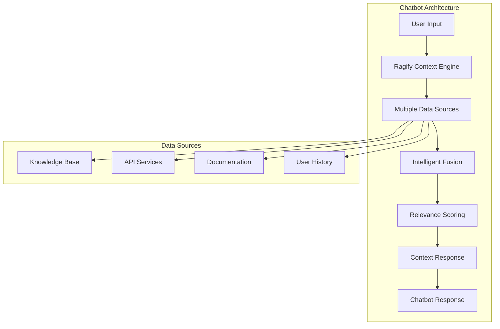

# 🤖 **Building Intelligent Chatbots**

This guide shows how to use Ragify to build intelligent chatbots that can access multiple data sources and provide contextually relevant responses.

## 🎯 **Overview**

Ragify enables chatbots to:
- Access multiple knowledge sources simultaneously
- Provide contextually relevant responses
- Learn from user interactions
- Handle complex queries with confidence scoring
- Maintain conversation context



## 🚀 **Quick Start**

### **1. Basic Chatbot Setup**

```python
import asyncio
from ragify import ContextOrchestrator, ContextRequest
from ragify.sources import DocumentSource, APISource
from ragify.models import SourceType

class IntelligentChatbot:
    def __init__(self):
        # Initialize Ragify orchestrator
        self.orchestrator = ContextOrchestrator()
        self.setup_data_sources()
    
    def setup_data_sources(self):
        # Add knowledge base
        knowledge_source = DocumentSource(
            name="knowledge_base",
            url="./knowledge_docs",
            chunk_size=1000
        )
        
        # Add API for real-time data
        weather_api = APISource(
            name="weather_api",
            url="https://api.weatherapi.com/v1/current.json",
            auth_type="api_key",
            auth_config={"api_key": "your_api_key"}
        )
        
        # Add sources to orchestrator
        self.orchestrator.add_source(knowledge_source)
        self.orchestrator.add_source(weather_api)
    
    async def get_response(self, user_message, user_id, session_id):
        # Get context from Ragify
        request = ContextRequest(
            query=user_message,
            user_id=user_id,
            session_id=session_id
        )
        
        response = await self.orchestrator.get_context(request)
        
        # Generate chatbot response using context
        return self.generate_response(response)
    
    def generate_response(self, context_response):
        # Use context chunks to generate response
        context_text = "\n".join([
            chunk.content for chunk in context_response.chunks
        ])
        
        # Here you would integrate with your LLM (GPT, Claude, etc.)
        # For now, return a simple response
        return f"Based on the context: {context_text[:200]}..."

# Usage
async def main():
    chatbot = IntelligentChatbot()
    
    response = await chatbot.get_response(
        "What is machine learning?",
        user_id="user123",
        session_id="session456"
    )
    
    print(response)

asyncio.run(main())
```

### **2. Advanced Chatbot with Multiple Sources**

```python
class AdvancedChatbot:
    def __init__(self):
        self.orchestrator = ContextOrchestrator()
        self.setup_comprehensive_sources()
    
    def setup_comprehensive_sources(self):
        # Company documentation
        self.orchestrator.add_source(
            DocumentSource(
                name="company_docs",
                url="./company_documentation",
                chunk_size=1500
            )
        )
        
        # Product knowledge base
        self.orchestrator.add_source(
            DocumentSource(
                name="product_kb",
                url="./product_knowledge",
                chunk_size=1000
            )
        )
        
        # Customer support database
        self.orchestrator.add_source(
            APISource(
                name="support_db",
                url="https://api.support.com/tickets",
                auth_type="bearer",
                auth_config={"token": "support_token"}
            )
        )
        
        # Real-time inventory
        self.orchestrator.add_source(
            APISource(
                name="inventory_api",
                url="https://api.inventory.com/stock",
                auth_type="api_key",
                auth_config={"api_key": "inventory_key"}
            )
        )
    
    async def handle_query(self, query, user_id, session_id):
        # Get context with high relevance threshold
        request = ContextRequest(
            query=query,
            user_id=user_id,
            session_id=session_id,
            min_relevance=0.7  # Only highly relevant context
        )
        
        response = await self.orchestrator.get_context(request)
        
        # Analyze response quality
        if len(response.chunks) == 0:
            return "I don't have enough information to answer that question."
        
        # Generate response based on context
        return self.generate_structured_response(response)
    
    def generate_structured_response(self, context_response):
        # Organize context by source
        context_by_source = {}
        for chunk in context_response.chunks:
            source = chunk.source.name
            if source not in context_by_source:
                context_by_source[source] = []
            context_by_source[source].append(chunk)
        
        # Generate response
        response_parts = []
        
        for source, chunks in context_by_source.items():
            source_content = "\n".join([c.content for c in chunks])
            avg_relevance = sum(c.relevance_score.score for c in chunks) / len(chunks)
            
            response_parts.append(f"From {source} (confidence: {avg_relevance:.2f}):")
            response_parts.append(source_content[:300] + "...")
            response_parts.append("")
        
        return "\n".join(response_parts)
```

## 🧠 **Intelligent Response Generation**

### **1. Context-Aware Responses**

```python
class ContextAwareChatbot:
    def __init__(self):
        self.orchestrator = ContextOrchestrator()
        self.conversation_history = {}
    
    async def get_context_aware_response(self, message, user_id, session_id):
        # Get conversation history
        history = self.conversation_history.get(session_id, [])
        
        # Build context-aware query
        context_query = self.build_context_query(message, history)
        
        # Get context from Ragify
        request = ContextRequest(
            query=context_query,
            user_id=user_id,
            session_id=session_id
        )
        
        response = await self.orchestrator.get_context(request)
        
        # Generate response considering conversation history
        bot_response = self.generate_context_aware_response(
            message, response, history
        )
        
        # Update conversation history
        history.append({"user": message, "bot": bot_response})
        self.conversation_history[session_id] = history[-10:]  # Keep last 10 exchanges
        
        return bot_response
    
    def build_context_query(self, message, history):
        # Include recent conversation context
        if history:
            recent_context = " ".join([
                f"{'User' if i % 2 == 0 else 'Assistant'}: {exchange['user' if i % 2 == 0 else 'bot']}"
                for i, exchange in enumerate(history[-3:])  # Last 3 exchanges
            ])
            return f"Context: {recent_context}\nCurrent question: {message}"
        return message
    
    def generate_context_aware_response(self, message, context_response, history):
        # Analyze user intent
        intent = self.analyze_intent(message)
        
        # Filter context based on intent
        relevant_chunks = self.filter_by_intent(context_response.chunks, intent)
        
        # Generate response
        if intent == "question":
            return self.generate_answer_response(relevant_chunks)
        elif intent == "clarification":
            return self.generate_clarification_response(relevant_chunks, history)
        elif intent == "follow_up":
            return self.generate_followup_response(relevant_chunks, history)
        else:
            return self.generate_general_response(relevant_chunks)
    
    def analyze_intent(self, message):
        # Simple intent analysis (in practice, use NLP libraries)
        question_words = ["what", "how", "why", "when", "where", "who"]
        if any(word in message.lower() for word in question_words):
            return "question"
        elif "clarify" in message.lower() or "explain" in message.lower():
            return "clarification"
        elif len(self.conversation_history) > 0:
            return "follow_up"
        else:
            return "general"
```

### **2. Confidence-Based Responses**

```python
class ConfidenceBasedChatbot:
    def __init__(self):
        self.orchestrator = ContextOrchestrator()
        self.confidence_thresholds = {
            "high": 0.8,
            "medium": 0.6,
            "low": 0.4
        }
    
    async def get_confidence_based_response(self, query, user_id):
        request = ContextRequest(
            query=query,
            user_id=user_id
        )
        
        response = await self.orchestrator.get_context(request)
        
        # Calculate overall confidence
        if not response.chunks:
            return self.generate_low_confidence_response()
        
        avg_confidence = sum(
            chunk.relevance_score.confidence_level 
            for chunk in response.chunks
        ) / len(response.chunks)
        
        # Generate response based on confidence level
        if avg_confidence >= self.confidence_thresholds["high"]:
            return self.generate_high_confidence_response(response)
        elif avg_confidence >= self.confidence_thresholds["medium"]:
            return self.generate_medium_confidence_response(response)
        elif avg_confidence >= self.confidence_thresholds["low"]:
            return self.generate_low_confidence_response(response)
        else:
            return self.generate_no_confidence_response()
    
    def generate_high_confidence_response(self, response):
        content = "\n".join([chunk.content for chunk in response.chunks])
        return f"I'm confident about this answer:\n\n{content}"
    
    def generate_medium_confidence_response(self, response):
        content = "\n".join([chunk.content for chunk in response.chunks])
        return f"Here's what I found, but you may want to verify:\n\n{content}"
    
    def generate_low_confidence_response(self, response):
        content = "\n".join([chunk.content for chunk in response.chunks])
        return f"I found some information, but I'm not very confident:\n\n{content}\n\nPlease verify this information."
    
    def generate_no_confidence_response(self):
        return "I don't have enough information to provide a reliable answer. Could you please rephrase your question or provide more context?"
```

## 🔄 **Conversation Management**

### **1. Session Management**

```python
class SessionAwareChatbot:
    def __init__(self):
        self.orchestrator = ContextOrchestrator()
        self.sessions = {}
    
    async def handle_conversation(self, message, user_id, session_id):
        # Get or create session
        session = self.get_session(session_id)
        
        # Add message to session
        session["messages"].append({
            "role": "user",
            "content": message,
            "timestamp": datetime.now()
        })
        
        # Get context with session history
        context = await self.get_session_context(message, session)
        
        # Generate response
        response = self.generate_response(context, session)
        
        # Add response to session
        session["messages"].append({
            "role": "assistant",
            "content": response,
            "timestamp": datetime.now()
        })
        
        return response
    
    def get_session(self, session_id):
        if session_id not in self.sessions:
            self.sessions[session_id] = {
                "messages": [],
                "context": {},
                "created_at": datetime.now()
            }
        return self.sessions[session_id]
    
    async def get_session_context(self, message, session):
        # Build query with session context
        session_context = self.build_session_context(session)
        query = f"{session_context}\nCurrent message: {message}"
        
        request = ContextRequest(
            query=query,
            user_id=session.get("user_id"),
            session_id=session.get("session_id")
        )
        
        return await self.orchestrator.get_context(request)
    
    def build_session_context(self, session):
        # Build context from recent messages
        recent_messages = session["messages"][-5:]  # Last 5 messages
        context_parts = []
        
        for msg in recent_messages:
            role = "User" if msg["role"] == "user" else "Assistant"
            context_parts.append(f"{role}: {msg['content']}")
        
        return "\n".join(context_parts)
```

### **2. Topic Tracking**

```python
class TopicTrackingChatbot:
    def __init__(self):
        self.orchestrator = ContextOrchestrator()
        self.topic_sessions = {}
    
    async def handle_topic_based_conversation(self, message, user_id, session_id):
        # Detect topic
        topic = self.detect_topic(message)
        
        # Get or create topic session
        topic_session = self.get_topic_session(session_id, topic)
        
        # Update topic context
        topic_session["messages"].append(message)
        topic_session["last_activity"] = datetime.now()
        
        # Get context specific to topic
        context = await self.get_topic_context(message, topic, topic_session)
        
        # Generate topic-aware response
        response = self.generate_topic_response(context, topic, topic_session)
        
        return response
    
    def detect_topic(self, message):
        # Simple topic detection (use NLP in practice)
        topics = {
            "technical": ["code", "programming", "bug", "error", "api"],
            "product": ["feature", "product", "pricing", "upgrade"],
            "support": ["help", "issue", "problem", "support", "ticket"],
            "general": ["hello", "thanks", "goodbye"]
        }
        
        message_lower = message.lower()
        for topic, keywords in topics.items():
            if any(keyword in message_lower for keyword in keywords):
                return topic
        
        return "general"
    
    def get_topic_session(self, session_id, topic):
        key = f"{session_id}_{topic}"
        if key not in self.topic_sessions:
            self.topic_sessions[key] = {
                "topic": topic,
                "messages": [],
                "context": {},
                "created_at": datetime.now()
            }
        return self.topic_sessions[key]
    
    async def get_topic_context(self, message, topic, topic_session):
        # Get context specific to topic
        topic_sources = self.get_topic_sources(topic)
        
        # Build topic-specific query
        query = f"Topic: {topic}\nMessage: {message}\nContext: {self.build_topic_context(topic_session)}"
        
        request = ContextRequest(
            query=query,
            user_id=topic_session.get("user_id")
        )
        
        return await self.orchestrator.get_context(request)
    
    def get_topic_sources(self, topic):
        # Return sources relevant to topic
        source_mapping = {
            "technical": ["technical_docs", "api_docs"],
            "product": ["product_kb", "pricing_docs"],
            "support": ["support_db", "faq_docs"],
            "general": ["general_kb"]
        }
        return source_mapping.get(topic, ["general_kb"])
```

## 🎯 **Specialized Chatbot Types**

### **1. Customer Support Chatbot**

```python
class CustomerSupportChatbot:
    def __init__(self):
        self.orchestrator = ContextOrchestrator()
        self.setup_support_sources()
    
    def setup_support_sources(self):
        # FAQ database
        self.orchestrator.add_source(
            DocumentSource(
                name="faq_database",
                url="./faq_documents",
                chunk_size=800
            )
        )
        
        # Knowledge base
        self.orchestrator.add_source(
            DocumentSource(
                name="knowledge_base",
                url="./support_knowledge",
                chunk_size=1000
            )
        )
        
        # Ticket system
        self.orchestrator.add_source(
            APISource(
                name="ticket_system",
                url="https://api.support.com/tickets",
                auth_type="bearer",
                auth_config={"token": "support_token"}
            )
        )
        
        # Product documentation
        self.orchestrator.add_source(
            DocumentSource(
                name="product_docs",
                url="./product_documentation",
                chunk_size=1200
            )
        )
    
    async def handle_support_query(self, query, user_id, priority="normal"):
        # Create support-specific request
        request = ContextRequest(
            query=query,
            user_id=user_id,
            metadata={
                "priority": priority,
                "query_type": "support"
            }
        )
        
        response = await self.orchestrator.get_context(request)
        
        # Generate support response
        return self.generate_support_response(response, priority)
    
    def generate_support_response(self, response, priority):
        if not response.chunks:
            return self.get_escalation_response(priority)
        
        # Organize by source type
        faq_chunks = [c for c in response.chunks if c.source.name == "faq_database"]
        kb_chunks = [c for c in response.chunks if c.source.name == "knowledge_base"]
        
        response_parts = []
        
        if faq_chunks:
            response_parts.append("**Frequently Asked Question:**")
            response_parts.append(faq_chunks[0].content)
            response_parts.append("")
        
        if kb_chunks:
            response_parts.append("**Knowledge Base Information:**")
            response_parts.append(kb_chunks[0].content)
            response_parts.append("")
        
        # Add escalation if needed
        if priority == "high" and len(response.chunks) < 2:
            response_parts.append(self.get_escalation_response(priority))
        
        return "\n".join(response_parts)
    
    def get_escalation_response(self, priority):
        if priority == "high":
            return "This appears to be a complex issue. I'm escalating this to a human support agent who will contact you shortly."
        else:
            return "If this doesn't resolve your issue, please contact our support team for further assistance."
```

### **2. Technical Documentation Chatbot**

```python
class TechnicalDocChatbot:
    def __init__(self):
        self.orchestrator = ContextOrchestrator()
        self.setup_technical_sources()
    
    def setup_technical_sources(self):
        # API documentation
        self.orchestrator.add_source(
            DocumentSource(
                name="api_docs",
                url="./api_documentation",
                chunk_size=1500
            )
        )
        
        # Code examples
        self.orchestrator.add_source(
            DocumentSource(
                name="code_examples",
                url="./code_examples",
                chunk_size=2000
            )
        )
        
        # Troubleshooting guides
        self.orchestrator.add_source(
            DocumentSource(
                name="troubleshooting",
                url="./troubleshooting_guides",
                chunk_size=1200
            )
        )
        
        # Best practices
        self.orchestrator.add_source(
            DocumentSource(
                name="best_practices",
                url="./best_practices",
                chunk_size=1000
            )
        )
    
    async def handle_technical_query(self, query, user_id, skill_level="intermediate"):
        # Add skill level context
        contextual_query = f"Skill level: {skill_level}\nQuery: {query}"
        
        request = ContextRequest(
            query=contextual_query,
            user_id=user_id,
            metadata={
                "skill_level": skill_level,
                "query_type": "technical"
            }
        )
        
        response = await self.orchestrator.get_context(request)
        
        return self.generate_technical_response(response, skill_level)
    
    def generate_technical_response(self, response, skill_level):
        if not response.chunks:
            return "I couldn't find relevant technical information. Please try rephrasing your question."
        
        # Organize by source
        api_chunks = [c for c in response.chunks if c.source.name == "api_docs"]
        code_chunks = [c for c in response.chunks if c.source.name == "code_examples"]
        troubleshooting_chunks = [c for c in response.chunks if c.source.name == "troubleshooting"]
        
        response_parts = []
        
        if api_chunks:
            response_parts.append("**API Documentation:**")
            response_parts.append(api_chunks[0].content)
            response_parts.append("")
        
        if code_chunks:
            response_parts.append("**Code Example:**")
            response_parts.append(f"```\n{code_chunks[0].content}\n```")
            response_parts.append("")
        
        if troubleshooting_chunks:
            response_parts.append("**Troubleshooting:**")
            response_parts.append(troubleshooting_chunks[0].content)
            response_parts.append("")
        
        # Add skill level specific guidance
        if skill_level == "beginner":
            response_parts.append("\n**For Beginners:** Consider starting with our getting started guide.")
        elif skill_level == "advanced":
            response_parts.append("\n**Advanced:** Check out our advanced patterns and optimization guides.")
        
        return "\n".join(response_parts)
```

## 📊 **Performance Optimization**

### **1. Response Caching**

```python
class CachedChatbot:
    def __init__(self):
        self.orchestrator = ContextOrchestrator()
        self.response_cache = {}
    
    async def get_cached_response(self, query, user_id):
        # Generate cache key
        cache_key = f"{hash(query)}_{user_id}"
        
        # Check cache
        if cache_key in self.response_cache:
            cached_response = self.response_cache[cache_key]
            if datetime.now() - cached_response["timestamp"] < timedelta(hours=1):
                return cached_response["response"]
        
        # Get fresh response
        response = await self.get_fresh_response(query, user_id)
        
        # Cache response
        self.response_cache[cache_key] = {
            "response": response,
            "timestamp": datetime.now()
        }
        
        return response
```

### **2. Response Quality Metrics**

```python
class QualityAwareChatbot:
    def __init__(self):
        self.orchestrator = ContextOrchestrator()
        self.quality_metrics = {}
    
    async def get_quality_response(self, query, user_id):
        response = await self.orchestrator.get_context(
            ContextRequest(query=query, user_id=user_id)
        )
        
        # Calculate quality metrics
        quality_score = self.calculate_quality_score(response)
        
        # Store metrics
        self.quality_metrics[user_id] = {
            "query": query,
            "quality_score": quality_score,
            "timestamp": datetime.now()
        }
        
        # Generate response with quality indicator
        return self.generate_quality_response(response, quality_score)
    
    def calculate_quality_score(self, response):
        if not response.chunks:
            return 0.0
        
        # Calculate based on relevance and confidence
        relevance_scores = [c.relevance_score.score for c in response.chunks]
        confidence_scores = [c.relevance_score.confidence_level for c in response.chunks]
        
        avg_relevance = sum(relevance_scores) / len(relevance_scores)
        avg_confidence = sum(confidence_scores) / len(confidence_scores)
        
        # Weighted quality score
        return (avg_relevance * 0.7) + (avg_confidence * 0.3)
    
    def generate_quality_response(self, response, quality_score):
        content = "\n".join([c.content for c in response.chunks])
        
        if quality_score >= 0.8:
            quality_indicator = "✅ High confidence"
        elif quality_score >= 0.6:
            quality_indicator = "⚠️ Medium confidence"
        else:
            quality_indicator = "❓ Low confidence"
        
        return f"{quality_indicator}\n\n{content}"
```

---

## 📚 **Next Steps**

- **[Real-time Applications](realtime-apps.md)** - Build real-time chatbots
- **[Knowledge Management](knowledge-management.md)** - Manage chatbot knowledge bases
- **[API Reference](api-reference.md)** - Complete API documentation
- **[Configuration](configuration.md)** - Advanced chatbot configuration
