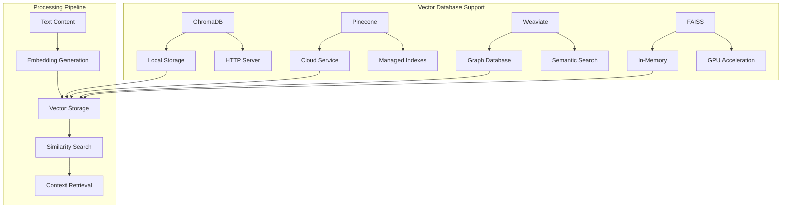

# 🧠 **Vector Databases**

Ragify provides comprehensive support for vector databases, enabling efficient similarity search and semantic retrieval of context chunks. This document explains how to configure and use different vector database backends.

## 🎯 **Overview**

Vector databases store high-dimensional vectors (embeddings) that represent text content, enabling fast similarity searches and semantic retrieval.



## 🏗️ **Supported Vector Databases**

### **1. ChromaDB**

ChromaDB is an open-source embedding database that provides both local and server-based storage.

#### **Features**
- ✅ Local file-based storage
- ✅ HTTP server mode
- ✅ Metadata filtering
- ✅ Automatic embedding generation
- ✅ Collection management

#### **Configuration**

```python
from ragify.storage import VectorDatabase

# Local ChromaDB
chroma_local = VectorDatabase(
    vector_db_url="chromadb://localhost:8000"
)

# ChromaDB with custom settings
chroma_custom = VectorDatabase(
    vector_db_url="chromadb://localhost:8000",
    collection_name="ragify_contexts",
    embedding_model="all-MiniLM-L6-v2",
    distance_metric="cosine"
)
```

#### **Usage Example**

```python
import asyncio
from ragify.storage import VectorDatabase
from ragify.models import ContextChunk

async def chromadb_example():
    # Initialize ChromaDB
    vector_db = VectorDatabase(
        vector_db_url="chromadb://localhost:8000",
        collection_name="documents"
    )
    
    # Store context chunks
    chunks = [
        ContextChunk(
            content="Machine learning is a subset of artificial intelligence.",
            source=source_info,
            relevance_score=relevance_info
        ),
        ContextChunk(
            content="Deep learning uses neural networks with multiple layers.",
            source=source_info,
            relevance_score=relevance_info
        )
    ]
    
    await vector_db.store_chunks(chunks)
    
    # Search for similar content
    query = "What is artificial intelligence?"
    results = await vector_db.search_similar(
        query=query,
        top_k=5,
        min_score=0.7
    )
    
    for result in results:
        print(f"Content: {result.content}")
        print(f"Similarity: {result.similarity_score:.3f}")
        print("---")

# Run example
asyncio.run(chromadb_example())
```

### **2. Pinecone**

Pinecone is a managed vector database service that provides high-performance similarity search.

#### **Features**
- ✅ Cloud-hosted service
- ✅ Automatic scaling
- ✅ High availability
- ✅ Real-time updates
- ✅ Metadata filtering

#### **Configuration**

```python
# Pinecone configuration
pinecone_db = VectorDatabase(
    vector_db_url="pinecone://your-index-name",
    api_key="your_pinecone_api_key",
    environment="us-west1-gcp"
)
```

#### **Usage Example**

```python
async def pinecone_example():
    # Initialize Pinecone
    vector_db = VectorDatabase(
        vector_db_url="pinecone://ragify-index",
        api_key="your_api_key",
        environment="us-west1-gcp"
    )
    
    # Store chunks with metadata
    chunks = [
        ContextChunk(
            content="Python is a high-level programming language.",
            source=source_info,
            relevance_score=relevance_info,
            metadata={
                "language": "python",
                "category": "programming",
                "difficulty": "beginner"
            }
        )
    ]
    
    await vector_db.store_chunks(chunks)
    
    # Search with metadata filtering
    results = await vector_db.search_similar(
        query="programming languages",
        top_k=10,
        min_score=0.6,
        filter={
            "category": "programming",
            "difficulty": {"$in": ["beginner", "intermediate"]}
        }
    )
    
    for result in results:
        print(f"Content: {result.content}")
        print(f"Category: {result.metadata.get('category')}")
        print(f"Similarity: {result.similarity_score:.3f}")
        print("---")

# Run example
asyncio.run(pinecone_example())
```

### **3. Weaviate**

Weaviate is a vector database with graph capabilities, combining vector search with structured data.

#### **Features**
- ✅ Vector + Graph database
- ✅ Schema-based data modeling
- ✅ GraphQL API
- ✅ Multi-modal support
- ✅ Semantic search

#### **Configuration**

```python
# Weaviate configuration
weaviate_db = VectorDatabase(
    vector_db_url="weaviate://localhost:8080",
    class_name="ContextChunk",
    schema_config={
        "properties": [
            {"name": "content", "dataType": ["text"]},
            {"name": "source", "dataType": ["text"]},
            {"name": "category", "dataType": ["text"]}
        ]
    }
)
```

#### **Usage Example**

```python
async def weaviate_example():
    # Initialize Weaviate
    vector_db = VectorDatabase(
        vector_db_url="weaviate://localhost:8080",
        class_name="DocumentChunks"
    )
    
    # Store chunks
    chunks = [
        ContextChunk(
            content="Data science combines statistics and programming.",
            source=source_info,
            relevance_score=relevance_info,
            metadata={
                "domain": "data_science",
                "type": "definition"
            }
        )
    ]
    
    await vector_db.store_chunks(chunks)
    
    # Graph-based search
    results = await vector_db.search_similar(
        query="statistics and programming",
        top_k=5,
        include_metadata=True
    )
    
    for result in results:
        print(f"Content: {result.content}")
        print(f"Domain: {result.metadata.get('domain')}")
        print(f"Type: {result.metadata.get('type')}")
        print("---")

# Run example
asyncio.run(weaviate_example())
```

### **4. FAISS**

FAISS is a library for efficient similarity search and clustering of dense vectors.

#### **Features**
- ✅ High-performance similarity search
- ✅ GPU acceleration support
- ✅ Multiple index types
- ✅ In-memory storage
- ✅ Custom distance metrics

#### **Configuration**

```python
# FAISS configuration
faiss_db = VectorDatabase(
    vector_db_url="faiss://memory",
    index_type="IVFFlat",  # or "Flat", "HNSW", etc.
    dimension=384,  # embedding dimension
    nlist=100  # number of clusters
)
```

#### **Usage Example**

```python
async def faiss_example():
    # Initialize FAISS
    vector_db = VectorDatabase(
        vector_db_url="faiss://memory",
        index_type="HNSW",
        dimension=384,
        metric="cosine"
    )
    
    # Store chunks
    chunks = [
        ContextChunk(
            content="Natural language processing enables computers to understand text.",
            source=source_info,
            relevance_score=relevance_info
        )
    ]
    
    await vector_db.store_chunks(chunks)
    
    # Fast similarity search
    results = await vector_db.search_similar(
        query="computer text understanding",
        top_k=10,
        min_score=0.5
    )
    
    for result in results:
        print(f"Content: {result.content}")
        print(f"Similarity: {result.similarity_score:.3f}")
        print("---")

# Run example
asyncio.run(faiss_example())
```

## 🔧 **Advanced Configuration**

### **1. Embedding Models**

```python
from sentence_transformers import SentenceTransformer

# Custom embedding model
custom_model = SentenceTransformer('all-mpnet-base-v2')

vector_db = VectorDatabase(
    vector_db_url="chromadb://localhost:8000",
    embedding_model=custom_model,
    dimension=768  # MPNet dimension
)
```

### **2. Index Configuration**

```python
# FAISS with custom index
faiss_config = {
    "index_type": "HNSW",
    "dimension": 384,
    "metric": "cosine",
    "M": 16,  # HNSW parameter
    "efConstruction": 200
}

vector_db = VectorDatabase(
    vector_db_url="faiss://memory",
    **faiss_config
)
```

### **3. Metadata Indexing**

```python
# Configure metadata indexing
metadata_config = {
    "indexed_fields": ["category", "source", "timestamp"],
    "filterable_fields": ["category", "source"],
    "searchable_fields": ["content", "title"]
}

vector_db = VectorDatabase(
    vector_db_url="pinecone://index",
    metadata_config=metadata_config
)
```

## 🔄 **Integration with Ragify**

### **1. Basic Integration**

```python
from ragify import ContextOrchestrator
from ragify.storage import VectorDatabase

# Initialize orchestrator with vector database
orchestrator = ContextOrchestrator()

# Add vector database
vector_db = VectorDatabase(
    vector_db_url="chromadb://localhost:8000"
)
orchestrator.vector_database = vector_db

# Context chunks are automatically stored and retrieved
request = ContextRequest(
    query="machine learning algorithms",
    user_id="user123"
)

response = await orchestrator.get_context(request)
```

### **2. Multi-Database Setup**

```python
# Use multiple vector databases
primary_db = VectorDatabase(
    vector_db_url="pinecone://primary-index"
)

secondary_db = VectorDatabase(
    vector_db_url="chromadb://localhost:8000"
)

# Configure orchestrator to use both
orchestrator.vector_databases = {
    "primary": primary_db,
    "secondary": secondary_db
}
```

### **3. Fallback Strategy**

```python
# Configure fallback strategy
async def get_context_with_fallback(query, user_id):
    try:
        # Try primary database
        response = await orchestrator.get_context(
            ContextRequest(query=query, user_id=user_id)
        )
        return response
    except Exception as e:
        # Fallback to secondary database
        orchestrator.vector_database = secondary_db
        response = await orchestrator.get_context(
            ContextRequest(query=query, user_id=user_id)
        )
        return response
```

## 📊 **Performance Optimization**

### **1. Batch Operations**

```python
# Batch store chunks for better performance
async def batch_store_chunks(chunks, batch_size=100):
    for i in range(0, len(chunks), batch_size):
        batch = chunks[i:i + batch_size]
        await vector_db.store_chunks(batch)
        print(f"Stored batch {i//batch_size + 1}")
```

### **2. Index Optimization**

```python
# Optimize FAISS index
async def optimize_faiss_index():
    if vector_db.index_type == "IVFFlat":
        # Train the index
        await vector_db.train_index()
        
        # Optimize parameters
        await vector_db.optimize_index(
            nprobe=10,  # Number of clusters to search
            ef_search=100  # Search depth
        )
```

### **3. Caching Strategy**

```python
# Implement caching for frequent queries
from ragify.storage import CacheManager

cache_manager = CacheManager(
    cache_url="redis://localhost:6379"
)

async def cached_search(query, user_id):
    cache_key = f"search:{hash(query)}:{user_id}"
    
    # Check cache first
    cached_result = await cache_manager.get(cache_key)
    if cached_result:
        return cached_result
    
    # Perform search
    results = await vector_db.search_similar(query, top_k=10)
    
    # Cache results
    await cache_manager.set(cache_key, results, ttl=300)
    
    return results
```

## 🔍 **Monitoring and Debugging**

### **1. Database Health Checks**

```python
async def check_vector_db_health():
    try:
        # Test connection
        await vector_db.ping()
        print("✅ Vector database connection successful")
        
        # Test basic operations
        test_chunk = ContextChunk(
            content="Test content",
            source=source_info,
            relevance_score=relevance_info
        )
        
        await vector_db.store_chunks([test_chunk])
        results = await vector_db.search_similar("test", top_k=1)
        
        if results:
            print("✅ Vector database operations successful")
        else:
            print("⚠️ No search results returned")
            
    except Exception as e:
        print(f"❌ Vector database error: {e}")

# Run health check
asyncio.run(check_vector_db_health())
```

### **2. Performance Metrics**

```python
async def get_performance_metrics():
    metrics = await vector_db.get_metrics()
    
    print("Vector Database Metrics:")
    print(f"  Total vectors: {metrics.get('total_vectors', 0)}")
    print(f"  Index size: {metrics.get('index_size_mb', 0):.2f} MB")
    print(f"  Search latency: {metrics.get('avg_search_time_ms', 0):.2f} ms")
    print(f"  Storage latency: {metrics.get('avg_store_time_ms', 0):.2f} ms")
    print(f"  Memory usage: {metrics.get('memory_usage_mb', 0):.2f} MB")

# Get metrics
asyncio.run(get_performance_metrics())
```

### **3. Debugging Search Results**

```python
async def debug_search_results(query, expected_results):
    # Perform search with detailed logging
    results = await vector_db.search_similar(
        query=query,
        top_k=10,
        include_metadata=True,
        debug=True
    )
    
    print(f"Query: {query}")
    print(f"Expected results: {expected_results}")
    print(f"Actual results: {len(results)}")
    
    for i, result in enumerate(results):
        print(f"\nResult {i+1}:")
        print(f"  Content: {result.content[:100]}...")
        print(f"  Similarity: {result.similarity_score:.3f}")
        print(f"  Metadata: {result.metadata}")
        
        # Check if this matches expected results
        if any(expected in result.content.lower() for expected in expected_results):
            print("  ✅ Matches expected content")
        else:
            print("  ❌ Doesn't match expected content")

# Debug search
asyncio.run(debug_search_results(
    query="machine learning",
    expected_results=["algorithm", "neural", "training"]
))
```

## 🚀 **Best Practices**

### **1. Database Selection**

| Use Case | Recommended Database | Reason |
|----------|---------------------|---------|
| Development/Testing | ChromaDB (local) | Easy setup, no external dependencies |
| Production (Small scale) | ChromaDB (server) | Good performance, open-source |
| Production (Large scale) | Pinecone | Managed service, auto-scaling |
| Graph + Vector | Weaviate | Combined capabilities |
| High performance | FAISS | Optimized for speed |

### **2. Index Configuration**

```python
# Choose appropriate index type
index_configs = {
    "small_dataset": {
        "type": "Flat",
        "description": "Exact search, small datasets"
    },
    "medium_dataset": {
        "type": "IVFFlat",
        "description": "Approximate search, medium datasets"
    },
    "large_dataset": {
        "type": "HNSW",
        "description": "Fast approximate search, large datasets"
    }
}
```

### **3. Embedding Optimization**

```python
# Use appropriate embedding models
embedding_models = {
    "general": "all-MiniLM-L6-v2",  # Fast, good quality
    "multilingual": "paraphrase-multilingual-MiniLM-L12-v2",
    "high_quality": "all-mpnet-base-v2",  # Slower, better quality
    "domain_specific": "custom_model"  # Fine-tuned for domain
}
```

---

## 📚 **Next Steps**

- **[Cache Management](cache-management.md)** - Learn about caching strategies
- **[Storage Engine](storage-engine.md)** - Understand storage and compression
- **[Configuration](configuration.md)** - Advanced configuration options
- **[API Reference](api-reference.md)** - Complete API documentation
