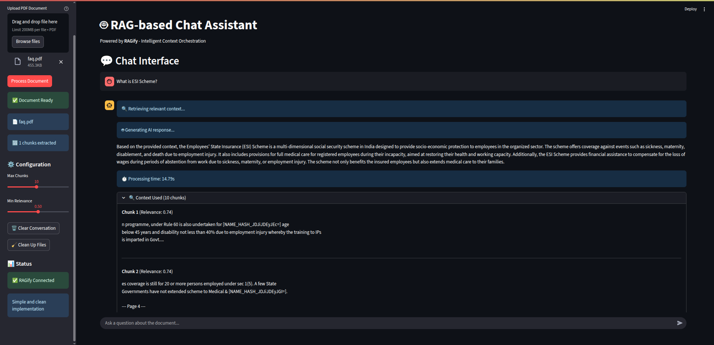
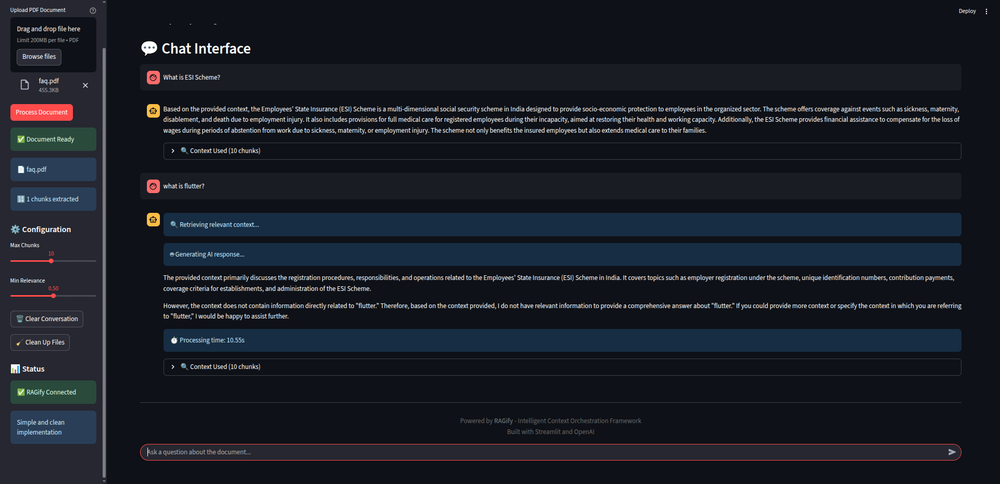

# 🤖 RAG-based Chat Assistant

A sophisticated Retrieval-Augmented Generation (RAG) chatbot built using the **RAGify** plugin, OpenAI, and Streamlit. This application demonstrates how to build a functional RAG system that can process PDF documents and provide intelligent, context-aware responses.

## 🖼️ Screenshots

### Main Interface


### Chat in Action


## 🎯 Features

### Core RAG Capabilities
- **📚 PDF Document Processing**: Extract and chunk text content intelligently
- **🔍 Vector Search**: Efficient retrieval using FAISS vector database
- **🤖 AI Generation**: OpenAI-powered response generation with context
- **📊 Simple & Clean**: No external dependencies, just core functionality

### Advanced Features
- **🧠 Intelligent Context Fusion**: RAGify's multi-source context orchestration
- **⚡ Real-time Processing**: Async document processing and query handling
- **🔒 Privacy Controls**: Configurable security levels and data handling
- **⚙️ Configurable Parameters**: Adjustable chunk sizes, relevance thresholds, and token limits

### User Experience
- **🎨 Modern UI**: Clean, responsive Streamlit interface
- **💬 Chat Interface**: Natural conversation flow with context visibility
- **📱 Responsive Design**: Works on desktop and mobile devices
- **🔄 Conversation History**: Persistent chat history with context details

## 🏗️ Architecture

```
┌─────────────────────────────────────────────────────────────────┐
│                    Streamlit UI                                │
├─────────────────────────────────────────────────────────────────┤
│                RAG Chat Assistant                              │
├─────────────────────────────────────────────────────────────────┤
│  ┌─────────────┐ ┌─────────────┐ ┌─────────────┐ ┌─────────────┐ │
│  │   RAGify    │ │   OpenAI    │ │   Vector    │ │   Cache     │ │
│  │Orchestrator │ │    API      │ │  Database   │ │  Manager    │ │
│  │             │ │             │ │             │ │             │ │
│  └─────────────┘ └─────────────┘ └─────────────┘ └─────────────┘ │
├─────────────────────────────────────────────────────────────────┤
│                    Data Sources                                 │
│  ┌─────────────┐ ┌─────────────┐ ┌─────────────┐ ┌─────────────┐ │
│  │    PDF      │ │   Vector    │ │    Cache    │ │   Storage   │ │
│  │ Documents   │ │ Embeddings  │ │   Manager   │ │   Engine    │ │
│  │             │ │             │ │             │ │             │ │
│  └─────────────┘ └─────────────┘ └─────────────┘ └─────────────┘ │
└─────────────────────────────────────────────────────────────────┘
```

## 🚀 Quick Start

### 1. Environment Setup

```bash
# Clone the repository
git clone <repository-url>
cd ragify/examples/rag_chat_assistant

# Create virtual environment
python -m venv venv
source venv/bin/activate  # On Windows: venv\Scripts\activate

# Install dependencies
pip install -r requirements.txt
```

### 2. Configuration

Copy the environment example file and configure your API key:

```bash
cp env_example.txt .env
```

Edit `.env` with your credentials:

```env
# OpenAI API Configuration
OPENAI_API_KEY=your_openai_api_key_here
OPENAI_MODEL=gpt-3.5-turbo

# RAGify Configuration
VECTOR_DB_URL=memory://
CACHE_URL=memory://
PRIVACY_LEVEL=PRIVATE

# Application Configuration
MAX_CHUNKS=10
MIN_RELEVANCE=0.5
MAX_TOKENS=4000
```

### 3. Run the Application

```bash
streamlit run rag_chat_assistant.py
```

The application will open in your browser at `http://localhost:8501`

## 📖 Usage Guide

### 1. Upload PDF Document
- Use the sidebar to upload a PDF document
- Click "Process Document" to extract and index the content
- The system will chunk the document and create vector embeddings

### 2. Ask Questions
- Once the document is processed, you can start asking questions
- Type your question in the chat input at the bottom
- The system will:
  - Retrieve relevant context chunks
  - Generate an AI response using OpenAI
  - Display the response with context details

### 3. View Context
- Each response includes expandable context sections
- See which document chunks were used
- View relevance scores for each chunk
- Monitor processing times and performance

### 4. Configuration
- Adjust `Max Chunks` to control context retrieval
- Modify `Min Relevance` to filter low-quality matches
- Clear conversation history when needed

## 🔧 Configuration Options

### RAGify Settings
- **Vector Database**: Choose between memory, FAISS, ChromaDB, Pinecone, or Weaviate
- **Cache Backend**: Configure Redis, Memcached, or memory-based caching
- **Privacy Level**: Set security levels (Public, Private, Enterprise, Restricted)

### Application Settings
- **Max Chunks**: Maximum number of context chunks to retrieve (1-20)
- **Min Relevance**: Minimum relevance score threshold (0.0-1.0)
- **Max Tokens**: Maximum tokens for OpenAI responses
- **Chunk Size**: Size of text chunks (default: 1000 characters)
- **Overlap**: Overlap between chunks (default: 200 characters)

## 🧪 Testing

### Sample PDFs
You can test the system with any PDF document. For best results, use:
- FAQ documents
- Product manuals
- Technical documentation
- Research papers
- Company policies

### Example Queries
- "What are the main features of this product?"
- "How do I troubleshoot common issues?"
- "What are the system requirements?"
- "Can you explain the installation process?"

### Expected Behavior
- ✅ PDF uploads and processes successfully
- ✅ Questions return relevant responses
- ✅ Context chunks are displayed with relevance scores
- ✅ Processing times are reasonable (< 10 seconds)

## 🚀 Deployment

### Local Development
```bash
streamlit run rag_chat_assistant.py --server.port 8501
```

### Environment Variables
All configuration is handled through environment variables, making it easy to deploy in different environments:

```bash
export OPENAI_API_KEY="your_key"
export VECTOR_DB_URL="faiss:///path/to/index"
export PRIVACY_LEVEL="ENTERPRISE"
```

## 🔍 Troubleshooting

### Common Issues

1. **PDF Processing Fails**
   - Ensure the PDF is not password-protected
   - Check if the PDF contains extractable text
   - Verify file size is reasonable (< 100MB)

2. **OpenAI API Errors**
   - Verify your API key is correct
   - Check API quota and rate limits
   - Ensure the model name is valid

3. **Vector Database Issues**
   - For memory-based DB: No additional setup needed
   - For FAISS: Ensure the directory is writable
   - For cloud DBs: Check network connectivity and credentials

4. **Performance Issues**
   - Reduce chunk size for faster processing
   - Lower max_chunks for quicker responses
   - Use caching for repeated queries

### Debug Mode
Enable debug logging by setting:

```bash
export STREAMLIT_LOG_LEVEL=debug
export RAGIFY_LOG_LEVEL=DEBUG
```

## 🤝 Contributing

We welcome contributions! Please see our contributing guidelines:

1. Fork the repository
2. Create a feature branch
3. Make your changes
4. Add tests
5. Submit a pull request

## 📄 License

This project is licensed under the MIT License - see the LICENSE file for details.

## 🙏 Acknowledgments

- **RAGify Team**: For the intelligent context orchestration framework
- **OpenAI**: For the powerful language models
- **Streamlit**: For the excellent web app framework

## 📞 Support

- **Issues**: Report bugs and feature requests on GitHub
- **Documentation**: Check the RAGify documentation
- **Community**: Join our Discord/community channels
- **Email**: Contact the development team

---

**Built with ❤️ using RAGify, OpenAI, and Streamlit**
